# HDFC Bank SmartGateway Payment Integration - Technical Design Document

## Overview

This document provides the comprehensive technical design for integrating HDFC Bank SmartGateway payment system into the SkillDad learning management platform. The integration replaces the current manual payment verification process with an automated, PCI-DSS compliant payment gateway supporting multiple payment methods including Credit/Debit cards, Net Banking, UPI, and digital wallets.

### Design Goals

1. **Security First**: Implement PCI-DSS compliant payment processing with end-to-end encryption and signature verification
2. **Seamless Integration**: Integrate with existing SkillDad enrollment flow without disrupting user experience
3. **Reliability**: Handle payment failures gracefully with retry mechanisms and comprehensive error handling
4. **Auditability**: Maintain complete transaction records for financial reconciliation and compliance
5. **Scalability**: Support high transaction volumes with efficient database design and API architecture
6. **Compliance**: Meet RBI guidelines and regulatory requirements for payment processing

### Key Features

- Multi-payment method support (Cards, Net Banking, UPI, Wallets)
- Real-time payment status updates via callbacks and webhooks
- Automated reconciliation with HDFC Bank settlement reports
- Comprehensive transaction tracking and audit trails
- Refund processing capabilities
- Discount code integration
- Payment receipt generation
- Admin configuration dashboard
- Real-time monitoring and alerting

## Architecture

### High-Level Architecture

The payment integration follows a layered architecture pattern with clear separation of concerns:

```
┌─────────────────────────────────────────────────────────────────┐
│                         Client Layer                             │
│  (React Frontend - Payment UI, Status Pages, Receipt Display)   │
└────────────────────────┬────────────────────────────────────────┘
                         │ HTTPS
                         ▼
┌─────────────────────────────────────────────────────────────────┐
│                      API Gateway Layer                           │
│         (Express.js Routes with Rate Limiting & CSRF)            │
└────────────────────────┬────────────────────────────────────────┘
                         │
                         ▼
┌─────────────────────────────────────────────────────────────────┐
│                    Business Logic Layer                          │
│  ┌──────────────┐  ┌──────────────┐  ┌──────────────┐          │
│  │   Payment    │  │  Enrollment  │  │ Reconciliation│          │
│  │  Controller  │  │  Controller  │  │   Service     │          │
│  └──────────────┘  └──────────────┘  └──────────────┘          │
└────────────────────────┬────────────────────────────────────────┘
                         │
                         ▼
┌─────────────────────────────────────────────────────────────────┐
│                    Integration Layer                             │
│  ┌──────────────────────────────────────────────────────┐       │
│  │         HDFC SmartGateway Service                     │       │
│  │  - Request Formatter                                  │       │
│  │  - Response Parser                                    │       │
│  │  - Signature Generator/Verifier                       │       │
│  │  - Encryption Handler                                 │       │
│  └──────────────────────────────────────────────────────┘       │
└────────────────────────┬────────────────────────────────────────┘
                         │
         ┌───────────────┼───────────────┐
         │               │               │
         ▼               ▼               ▼
┌─────────────┐  ┌─────────────┐  ┌─────────────┐
│  MongoDB    │  │    Redis    │  │   Email     │
│  Database   │  │   Cache     │  │  Service    │
└─────────────┘  └─────────────┘  └─────────────┘
         │
         │ HTTPS
         ▼
┌─────────────────────────────────────────────────────────────────┐
│              HDFC Bank SmartGateway                              │
│  - Payment Processing                                            │
│  - Webhook Notifications                                         │
│  - Settlement Reports                                            │
└─────────────────────────────────────────────────────────────────┘
```

### Component Architecture

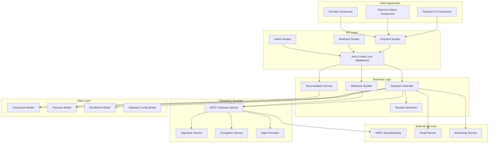

### Payment Flow Sequence

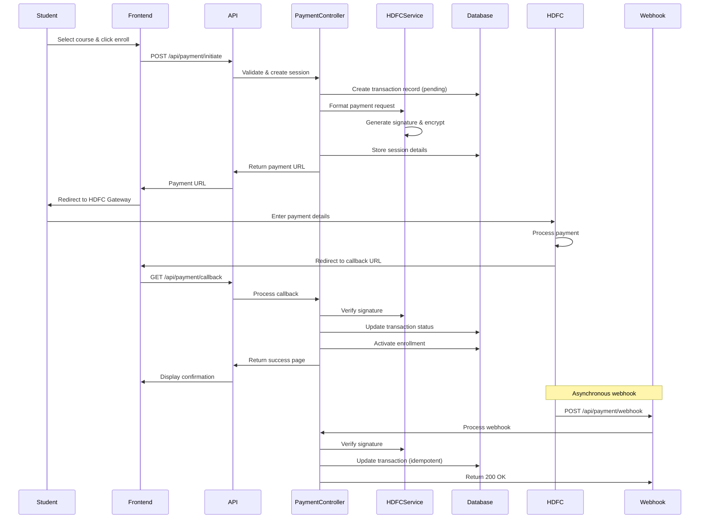

### Security Architecture

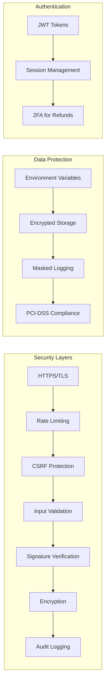

## Components and Interfaces

### 1. Payment Controller

**Responsibility**: Orchestrates payment operations and coordinates between services

**Key Methods**:
- `initiatePayment(studentId, courseId, discountCode)`: Creates payment session
- `handleCallback(callbackData)`: Processes payment gateway callback
- `checkPaymentStatus(transactionId)`: Queries real-time payment status
- `processRefund(transactionId, amount, adminId)`: Initiates refund
- `getPaymentHistory(studentId)`: Retrieves student payment history

**Interface**:
```javascript
class PaymentController {
  async initiatePayment(req, res) {
    // Validates course, student, discount code
    // Creates transaction record
    // Generates payment request
    // Returns payment gateway URL
  }
  
  async handleCallback(req, res) {
    // Verifies signature
    // Updates transaction status
    // Activates enrollment on success
    // Sends confirmation email
    // Renders confirmation page
  }
  
  async handleWebhook(req, res) {
    // Verifies signature
    // Idempotent transaction update
    // Returns 200 OK
  }
  
  async processRefund(req, res) {
    // Validates refund eligibility
    // Sends refund request to gateway
    // Updates transaction status
    // Deactivates enrollment
    // Sends refund confirmation
  }
}
```

### 2. HDFC Gateway Service

**Responsibility**: Handles all communication with HDFC SmartGateway API

**Key Methods**:
- `createPaymentRequest(transactionData)`: Formats and signs payment request
- `verifyCallback(callbackData)`: Verifies callback signature
- `verifyWebhook(webhookData)`: Verifies webhook signature
- `queryTransactionStatus(transactionId)`: Queries payment status
- `initiateRefund(transactionId, amount)`: Sends refund request
- `fetchSettlementReport(date)`: Retrieves settlement data

**Interface**:
```javascript
class HDFCGatewayService {
  constructor(config) {
    this.merchantId = config.merchantId;
    this.apiKey = config.apiKey;
    this.apiSecret = config.apiSecret;
    this.gatewayUrl = config.gatewayUrl;
    this.encryptionService = new EncryptionService();
    this.signatureService = new SignatureService();
  }
  
  async createPaymentRequest(transactionData) {
    // Format data per HDFC specification
    // Generate signature
    // Encrypt sensitive fields
    // Return payment URL with parameters
  }
  
  verifySignature(data, signature) {
    // Compute HMAC-SHA256
    // Compare with provided signature
    // Return boolean
  }
  
  async queryTransactionStatus(transactionId) {
    // Call HDFC status API
    // Parse response
    // Return status object
  }
}
```

### 3. Signature Service

**Responsibility**: Generates and verifies HMAC-SHA256 signatures

**Interface**:
```javascript
class SignatureService {
  generateSignature(data, secret) {
    // Sort parameters alphabetically
    // Concatenate key=value pairs
    // Compute HMAC-SHA256
    // Return hex signature
  }
  
  verifySignature(data, signature, secret) {
    // Generate expected signature
    // Constant-time comparison
    // Return boolean
  }
}
```

### 4. Encryption Service

**Responsibility**: Encrypts and decrypts sensitive payment data

**Interface**:
```javascript
class EncryptionService {
  encrypt(plaintext, key) {
    // AES-256-GCM encryption
    // Generate IV
    // Return encrypted data with IV and auth tag
  }
  
  decrypt(ciphertext, key, iv, authTag) {
    // AES-256-GCM decryption
    // Verify auth tag
    // Return plaintext
  }
}
```

### 5. Data Formatter Service

**Responsibility**: Formats and parses payment data

**Interface**:
```javascript
class DataFormatterService {
  formatPaymentRequest(transactionData) {
    // Convert to HDFC format
    // Validate required fields
    // Format amounts and dates
    // Return formatted object
  }
  
  parsePaymentResponse(responseData) {
    // Parse HDFC response (JSON/XML/form-encoded)
    // Validate data types
    // Convert to internal format
    // Return parsed object
  }
  
  formatReceipt(transactionData) {
    // Format transaction data for receipt
    // Calculate GST breakdown
    // Generate receipt HTML/PDF
    // Return receipt data
  }
}
```

### 6. Reconciliation Service

**Responsibility**: Reconciles payments with HDFC settlement reports

**Interface**:
```javascript
class ReconciliationService {
  async fetchSettlementReport(date) {
    // Call HDFC settlement API
    // Parse settlement data
    // Return settlement records
  }
  
  async reconcileTransactions(date) {
    // Fetch local transactions
    // Fetch settlement report
    // Compare and match
    // Flag discrepancies
    // Generate reconciliation report
  }
  
  async generateReconciliationReport(startDate, endDate) {
    // Aggregate transaction data
    // Calculate totals
    // Export to CSV/Excel
    // Return report
  }
}
```

### 7. Receipt Generator Service

**Responsibility**: Generates payment receipts in PDF format

**Interface**:
```javascript
class ReceiptGeneratorService {
  async generateReceipt(transactionId) {
    // Fetch transaction data
    // Format receipt content
    // Generate PDF
    // Upload to storage
    // Return receipt URL
  }
  
  async emailReceipt(transactionId, studentEmail) {
    // Generate receipt
    // Attach to email
    // Send via email service
  }
}
```

### 8. Monitoring Service

**Responsibility**: Tracks payment system health and performance

**Interface**:
```javascript
class MonitoringService {
  trackPaymentAttempt(transactionId, status) {
    // Log payment attempt
    // Update metrics
  }
  
  trackAPIResponseTime(endpoint, duration) {
    // Log response time
    // Update metrics
  }
  
  async getPaymentMetrics(timeRange) {
    // Calculate success rate
    // Calculate average processing time
    // Get failure reasons distribution
    // Return metrics object
  }
  
  async checkSystemHealth() {
    // Check HDFC gateway connectivity
    // Check database connectivity
    // Check success rate threshold
    // Return health status
  }
}
```


## Data Models

### Transaction Model

The Transaction model is the central entity for tracking all payment operations. It extends the existing Payment model with gateway-specific fields.

```javascript
const transactionSchema = mongoose.Schema({
  // Core Transaction Info
  transactionId: {
    type: String,
    required: true,
    unique: true,
    index: true,
  },
  
  // References
  student: {
    type: mongoose.Schema.Types.ObjectId,
    required: true,
    ref: 'User',
    index: true,
  },
  course: {
    type: mongoose.Schema.Types.ObjectId,
    required: true,
    ref: 'Course',
  },
  enrollment: {
    type: mongoose.Schema.Types.ObjectId,
    ref: 'Enrollment',
  },
  
  // Amount Details
  originalAmount: {
    type: mongoose.Types.Decimal128,
    required: true,
  },
  discountAmount: {
    type: mongoose.Types.Decimal128,
    default: 0,
  },
  finalAmount: {
    type: mongoose.Types.Decimal128,
    required: true,
  },
  gstAmount: {
    type: mongoose.Types.Decimal128,
    default: 0,
  },
  currency: {
    type: String,
    default: 'INR',
    enum: ['INR'],
  },
  
  // Discount Info
  discountCode: {
    type: String,
    uppercase: true,
  },
  discountPercentage: {
    type: Number,
    min: 0,
    max: 100,
  },
  
  // Payment Status
  status: {
    type: String,
    enum: ['pending', 'processing', 'success', 'failed', 'refunded', 'partial_refund'],
    default: 'pending',
    index: true,
  },
  
  // Gateway Details
  gatewayTransactionId: {
    type: String,
    index: true,
  },
  gatewayOrderId: {
    type: String,
  },
  paymentMethod: {
    type: String,
    enum: ['credit_card', 'debit_card', 'net_banking', 'upi', 'wallet', 'unknown'],
  },
  paymentMethodDetails: {
    cardType: String,        // Visa, Mastercard, RuPay
    cardLast4: String,       // Last 4 digits
    bankName: String,        // For net banking
    upiId: String,          // For UPI (masked)
    walletProvider: String, // Paytm, PhonePe, etc.
  },
  
  // Session Management
  sessionId: {
    type: String,
    required: true,
  },
  sessionExpiresAt: {
    type: Date,
    required: true,
    index: true,
  },
  
  // Callback & Webhook Data
  callbackData: {
    type: mongoose.Schema.Types.Mixed,
  },
  callbackReceivedAt: {
    type: Date,
  },
  webhookData: [{
    data: mongoose.Schema.Types.Mixed,
    receivedAt: Date,
    processed: Boolean,
  }],
  
  // Signature Verification
  callbackSignatureVerified: {
    type: Boolean,
  },
  webhookSignatureVerified: {
    type: Boolean,
  },
  
  // Retry Management
  retryCount: {
    type: Number,
    default: 0,
  },
  lastRetryAt: {
    type: Date,
  },
  
  // Refund Details
  refundAmount: {
    type: mongoose.Types.Decimal128,
    default: 0,
  },
  refundTransactionId: {
    type: String,
  },
  refundInitiatedBy: {
    type: mongoose.Schema.Types.ObjectId,
    ref: 'User',
  },
  refundInitiatedAt: {
    type: Date,
  },
  refundCompletedAt: {
    type: Date,
  },
  refundReason: {
    type: String,
  },
  
  // Receipt
  receiptNumber: {
    type: String,
    unique: true,
    sparse: true,
  },
  receiptUrl: {
    type: String,
  },
  receiptGeneratedAt: {
    type: Date,
  },
  
  // Reconciliation
  reconciledAt: {
    type: Date,
  },
  reconciledBy: {
    type: mongoose.Schema.Types.ObjectId,
    ref: 'User',
  },
  settlementDate: {
    type: Date,
  },
  settlementAmount: {
    type: mongoose.Types.Decimal128,
  },
  
  // Error Tracking
  errorCode: {
    type: String,
  },
  errorMessage: {
    type: String,
  },
  errorCategory: {
    type: String,
    enum: ['network', 'gateway', 'validation', 'insufficient_funds', 'card_declined', 'expired', 'other'],
  },
  
  // Audit Trail
  ipAddress: {
    type: String,
  },
  userAgent: {
    type: String,
  },
  
  // Timestamps
  initiatedAt: {
    type: Date,
    default: Date.now,
  },
  completedAt: {
    type: Date,
  },
}, {
  timestamps: true,
});

// Indexes for performance
transactionSchema.index({ student: 1, createdAt: -1 });
transactionSchema.index({ status: 1, createdAt: -1 });
transactionSchema.index({ gatewayTransactionId: 1 });
transactionSchema.index({ sessionExpiresAt: 1 }, { expireAfterSeconds: 0 });

// Virtual for formatted amount
transactionSchema.virtual('finalAmountFormatted').get(function() {
  return parseFloat(this.finalAmount.toString()).toFixed(2);
});

module.exports = mongoose.model('Transaction', transactionSchema);
```

### Gateway Configuration Model

Stores HDFC SmartGateway configuration settings.

```javascript
const gatewayConfigSchema = mongoose.Schema({
  merchantId: {
    type: String,
    required: true,
  },
  merchantName: {
    type: String,
    required: true,
  },
  
  // API Credentials (encrypted)
  apiKey: {
    type: String,
    required: true,
  },
  apiSecret: {
    type: String,
    required: true,
  },
  encryptionKey: {
    type: String,
    required: true,
  },
  
  // Gateway URLs
  gatewayUrl: {
    type: String,
    required: true,
  },
  callbackUrl: {
    type: String,
    required: true,
  },
  webhookUrl: {
    type: String,
    required: true,
  },
  
  // Payment Method Configuration
  enabledPaymentMethods: [{
    type: String,
    enum: ['credit_card', 'debit_card', 'net_banking', 'upi', 'wallet'],
  }],
  
  // Transaction Limits
  minTransactionAmount: {
    type: Number,
    default: 10,
  },
  maxTransactionAmount: {
    type: Number,
    default: 500000,
  },
  
  // Session Configuration
  sessionTimeoutMinutes: {
    type: Number,
    default: 15,
  },
  
  // Environment
  environment: {
    type: String,
    enum: ['sandbox', 'production'],
    default: 'sandbox',
  },
  
  // Status
  isActive: {
    type: Boolean,
    default: true,
  },
  
  // Audit
  lastModifiedBy: {
    type: mongoose.Schema.Types.ObjectId,
    ref: 'User',
  },
}, {
  timestamps: true,
});

module.exports = mongoose.model('GatewayConfig', gatewayConfigSchema);
```

### Payment Session Model

Temporary storage for active payment sessions (can use Redis for better performance).

```javascript
const paymentSessionSchema = mongoose.Schema({
  sessionId: {
    type: String,
    required: true,
    unique: true,
    index: true,
  },
  transactionId: {
    type: String,
    required: true,
    ref: 'Transaction',
  },
  student: {
    type: mongoose.Schema.Types.ObjectId,
    required: true,
    ref: 'User',
  },
  course: {
    type: mongoose.Schema.Types.ObjectId,
    required: true,
    ref: 'Course',
  },
  amount: {
    type: mongoose.Types.Decimal128,
    required: true,
  },
  status: {
    type: String,
    enum: ['active', 'completed', 'expired', 'cancelled'],
    default: 'active',
  },
  expiresAt: {
    type: Date,
    required: true,
    index: true,
  },
  createdAt: {
    type: Date,
    default: Date.now,
    expires: 900, // Auto-delete after 15 minutes
  },
});

module.exports = mongoose.model('PaymentSession', paymentSessionSchema);
```

### Reconciliation Record Model

Tracks reconciliation operations.

```javascript
const reconciliationSchema = mongoose.Schema({
  reconciliationDate: {
    type: Date,
    required: true,
    index: true,
  },
  startDate: {
    type: Date,
    required: true,
  },
  endDate: {
    type: Date,
    required: true,
  },
  
  // Summary
  totalTransactions: {
    type: Number,
    default: 0,
  },
  matchedTransactions: {
    type: Number,
    default: 0,
  },
  unmatchedTransactions: {
    type: Number,
    default: 0,
  },
  
  // Amounts
  totalAmount: {
    type: mongoose.Types.Decimal128,
    default: 0,
  },
  settledAmount: {
    type: mongoose.Types.Decimal128,
    default: 0,
  },
  pendingAmount: {
    type: mongoose.Types.Decimal128,
    default: 0,
  },
  
  // Discrepancies
  discrepancies: [{
    transactionId: String,
    type: {
      type: String,
      enum: ['missing_in_system', 'missing_in_gateway', 'amount_mismatch', 'status_mismatch'],
    },
    systemAmount: mongoose.Types.Decimal128,
    gatewayAmount: mongoose.Types.Decimal128,
    resolved: {
      type: Boolean,
      default: false,
    },
    resolvedBy: {
      type: mongoose.Schema.Types.ObjectId,
      ref: 'User',
    },
    resolvedAt: Date,
    notes: String,
  }],
  
  // Report
  reportUrl: {
    type: String,
  },
  
  // Audit
  performedBy: {
    type: mongoose.Schema.Types.ObjectId,
    ref: 'User',
  },
  status: {
    type: String,
    enum: ['in_progress', 'completed', 'failed'],
    default: 'in_progress',
  },
}, {
  timestamps: true,
});

module.exports = mongoose.model('Reconciliation', reconciliationSchema);
```

### Database Schema Diagram

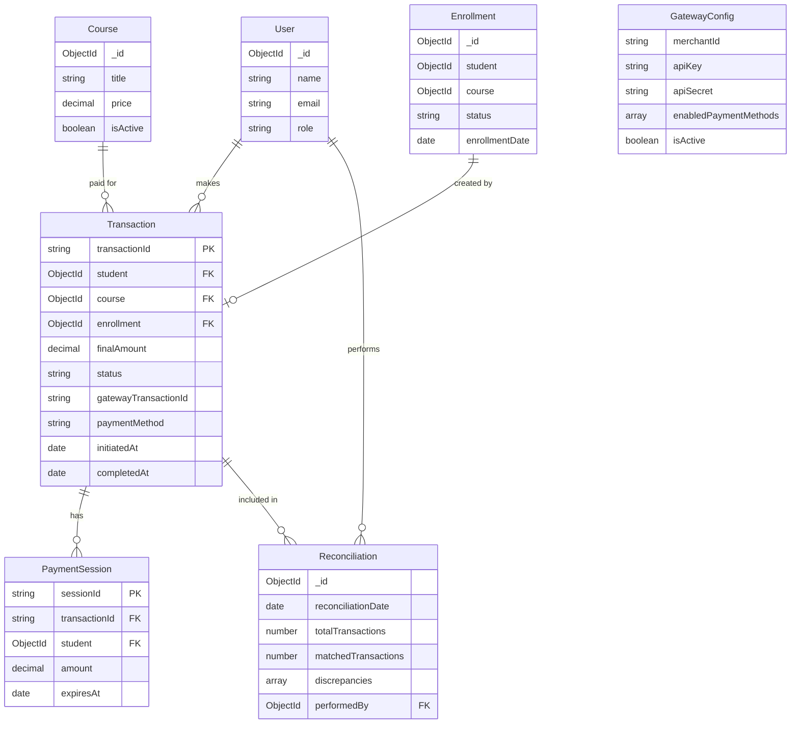


## API Endpoints and Routes

### Payment Routes (`/api/payment`)

#### 1. Initiate Payment

**Endpoint**: `POST /api/payment/initiate`

**Authentication**: Required (JWT)

**Request Body**:
```json
{
  "courseId": "507f1f77bcf86cd799439011",
  "discountCode": "PARTNER20"
}
```

**Response**:
```json
{
  "success": true,
  "transactionId": "TXN_1234567890",
  "sessionId": "SES_9876543210",
  "paymentUrl": "https://smartgateway.hdfcbank.com/pay?session=...",
  "expiresAt": "2024-01-15T10:30:00Z",
  "amount": {
    "original": 10000.00,
    "discount": 2000.00,
    "final": 8000.00,
    "gst": 1440.00,
    "total": 9440.00
  }
}
```

**Error Responses**:
- `400`: Invalid course ID or discount code
- `401`: Unauthorized
- `409`: Active enrollment already exists
- `500`: Server error

---

#### 2. Payment Callback

**Endpoint**: `GET /api/payment/callback`

**Authentication**: None (signature verified)

**Query Parameters**:
```
transactionId=TXN_1234567890
status=success
gatewayTransactionId=HDFC_987654321
signature=abc123def456...
```

**Response**: HTML page with payment confirmation

**Process**:
1. Verify signature
2. Update transaction status
3. Activate enrollment if success
4. Generate receipt
5. Send confirmation email
6. Render confirmation page

---

#### 3. Payment Webhook

**Endpoint**: `POST /api/payment/webhook`

**Authentication**: Signature verification

**Request Body**:
```json
{
  "transactionId": "TXN_1234567890",
  "gatewayTransactionId": "HDFC_987654321",
  "status": "success",
  "amount": 9440.00,
  "paymentMethod": "credit_card",
  "paymentMethodDetails": {
    "cardType": "Visa",
    "cardLast4": "1234"
  },
  "timestamp": "2024-01-15T10:25:30Z",
  "signature": "xyz789abc123..."
}
```

**Response**:
```json
{
  "success": true,
  "message": "Webhook processed successfully"
}
```

**Error Responses**:
- `401`: Invalid signature
- `404`: Transaction not found
- `500`: Processing error

---

#### 4. Check Payment Status

**Endpoint**: `GET /api/payment/status/:transactionId`

**Authentication**: Required (JWT)

**Response**:
```json
{
  "success": true,
  "transaction": {
    "transactionId": "TXN_1234567890",
    "status": "success",
    "amount": 9440.00,
    "paymentMethod": "credit_card",
    "initiatedAt": "2024-01-15T10:20:00Z",
    "completedAt": "2024-01-15T10:25:30Z",
    "receiptUrl": "https://skilldad.com/receipts/TXN_1234567890.pdf"
  }
}
```

---

#### 5. Get Payment History

**Endpoint**: `GET /api/payment/history`

**Authentication**: Required (JWT)

**Query Parameters**:
- `page`: Page number (default: 1)
- `limit`: Items per page (default: 10)
- `status`: Filter by status (optional)

**Response**:
```json
{
  "success": true,
  "transactions": [
    {
      "transactionId": "TXN_1234567890",
      "course": {
        "id": "507f1f77bcf86cd799439011",
        "title": "Full Stack Development"
      },
      "amount": 9440.00,
      "status": "success",
      "paymentMethod": "credit_card",
      "initiatedAt": "2024-01-15T10:20:00Z",
      "completedAt": "2024-01-15T10:25:30Z"
    }
  ],
  "pagination": {
    "currentPage": 1,
    "totalPages": 3,
    "totalItems": 25,
    "itemsPerPage": 10
  }
}
```

---

#### 6. Download Receipt

**Endpoint**: `GET /api/payment/receipt/:transactionId`

**Authentication**: Required (JWT)

**Response**: PDF file download

---

#### 7. Retry Payment

**Endpoint**: `POST /api/payment/retry/:transactionId`

**Authentication**: Required (JWT)

**Response**:
```json
{
  "success": true,
  "newTransactionId": "TXN_1234567891",
  "paymentUrl": "https://smartgateway.hdfcbank.com/pay?session=...",
  "retryCount": 2
}
```

**Error Responses**:
- `400`: Retry limit exceeded
- `404`: Transaction not found
- `409`: Payment already successful

---

### Admin Routes (`/api/admin/payment`)

#### 1. Process Refund

**Endpoint**: `POST /api/admin/payment/refund`

**Authentication**: Required (Admin role + 2FA)

**Request Body**:
```json
{
  "transactionId": "TXN_1234567890",
  "amount": 9440.00,
  "reason": "Course cancellation requested by student"
}
```

**Response**:
```json
{
  "success": true,
  "refundTransactionId": "RFD_1234567890",
  "status": "processing",
  "estimatedCompletionDate": "2024-01-22T00:00:00Z"
}
```

---

#### 2. Get Gateway Configuration

**Endpoint**: `GET /api/admin/payment/config`

**Authentication**: Required (Admin role)

**Response**:
```json
{
  "success": true,
  "config": {
    "merchantId": "SKILLDAD_HDFC",
    "environment": "production",
    "enabledPaymentMethods": ["credit_card", "debit_card", "upi", "net_banking"],
    "minTransactionAmount": 10,
    "maxTransactionAmount": 500000,
    "sessionTimeoutMinutes": 15,
    "isActive": true
  }
}
```

---

#### 3. Update Gateway Configuration

**Endpoint**: `PUT /api/admin/payment/config`

**Authentication**: Required (Admin role)

**Request Body**:
```json
{
  "enabledPaymentMethods": ["credit_card", "debit_card", "upi"],
  "minTransactionAmount": 50,
  "maxTransactionAmount": 300000,
  "sessionTimeoutMinutes": 20
}
```

**Response**:
```json
{
  "success": true,
  "message": "Configuration updated successfully"
}
```

---

#### 4. Test Gateway Connection

**Endpoint**: `POST /api/admin/payment/test-connection`

**Authentication**: Required (Admin role)

**Response**:
```json
{
  "success": true,
  "gatewayStatus": "connected",
  "responseTime": 245,
  "timestamp": "2024-01-15T10:30:00Z"
}
```

---

### Reconciliation Routes (`/api/admin/reconciliation`)

#### 1. Run Reconciliation

**Endpoint**: `POST /api/admin/reconciliation/run`

**Authentication**: Required (Finance role)

**Request Body**:
```json
{
  "startDate": "2024-01-01",
  "endDate": "2024-01-31"
}
```

**Response**:
```json
{
  "success": true,
  "reconciliationId": "REC_1234567890",
  "status": "in_progress"
}
```

---

#### 2. Get Reconciliation Report

**Endpoint**: `GET /api/admin/reconciliation/:reconciliationId`

**Authentication**: Required (Finance role)

**Response**:
```json
{
  "success": true,
  "report": {
    "reconciliationId": "REC_1234567890",
    "reconciliationDate": "2024-02-01T00:00:00Z",
    "startDate": "2024-01-01",
    "endDate": "2024-01-31",
    "summary": {
      "totalTransactions": 1250,
      "matchedTransactions": 1245,
      "unmatchedTransactions": 5,
      "totalAmount": 12500000.00,
      "settledAmount": 12450000.00,
      "pendingAmount": 50000.00
    },
    "discrepancies": [
      {
        "transactionId": "TXN_1234567890",
        "type": "amount_mismatch",
        "systemAmount": 10000.00,
        "gatewayAmount": 9950.00,
        "resolved": false
      }
    ],
    "reportUrl": "https://skilldad.com/reports/REC_1234567890.xlsx"
  }
}
```

---

#### 3. Resolve Discrepancy

**Endpoint**: `POST /api/admin/reconciliation/resolve`

**Authentication**: Required (Finance role)

**Request Body**:
```json
{
  "reconciliationId": "REC_1234567890",
  "transactionId": "TXN_1234567890",
  "notes": "Gateway fee deducted, amount verified with bank statement"
}
```

**Response**:
```json
{
  "success": true,
  "message": "Discrepancy resolved successfully"
}
```

---

### Monitoring Routes (`/api/admin/monitoring`)

#### 1. Get Payment Metrics

**Endpoint**: `GET /api/admin/monitoring/metrics`

**Authentication**: Required (Admin role)

**Query Parameters**:
- `timeRange`: `24h`, `7d`, `30d` (default: `24h`)

**Response**:
```json
{
  "success": true,
  "metrics": {
    "timeRange": "24h",
    "totalAttempts": 150,
    "successfulPayments": 142,
    "failedPayments": 8,
    "successRate": 94.67,
    "averageProcessingTime": 3.2,
    "totalAmount": 1420000.00,
    "paymentMethodDistribution": {
      "credit_card": 45,
      "debit_card": 38,
      "upi": 42,
      "net_banking": 17
    },
    "failureReasons": {
      "insufficient_funds": 3,
      "card_declined": 2,
      "network_error": 2,
      "gateway_timeout": 1
    }
  }
}
```

---

#### 2. Get System Health

**Endpoint**: `GET /api/admin/monitoring/health`

**Authentication**: Required (Admin role)

**Response**:
```json
{
  "success": true,
  "health": {
    "overall": "healthy",
    "components": {
      "database": {
        "status": "healthy",
        "responseTime": 12
      },
      "hdfc_gateway": {
        "status": "healthy",
        "responseTime": 245
      },
      "redis_cache": {
        "status": "healthy",
        "responseTime": 5
      }
    },
    "alerts": [],
    "lastChecked": "2024-01-15T10:30:00Z"
  }
}
```

---

### Route Summary Table

| Method | Endpoint | Auth | Rate Limit | Purpose |
|--------|----------|------|------------|---------|
| POST | `/api/payment/initiate` | JWT | 5/min | Create payment session |
| GET | `/api/payment/callback` | Signature | - | Handle payment callback |
| POST | `/api/payment/webhook` | Signature | - | Handle webhook notification |
| GET | `/api/payment/status/:id` | JWT | 10/min | Check payment status |
| GET | `/api/payment/history` | JWT | 10/min | Get payment history |
| GET | `/api/payment/receipt/:id` | JWT | 10/min | Download receipt |
| POST | `/api/payment/retry/:id` | JWT | 3/hour | Retry failed payment |
| POST | `/api/admin/payment/refund` | Admin+2FA | 10/hour | Process refund |
| GET | `/api/admin/payment/config` | Admin | 20/min | Get configuration |
| PUT | `/api/admin/payment/config` | Admin | 5/min | Update configuration |
| POST | `/api/admin/payment/test-connection` | Admin | 5/min | Test gateway |
| POST | `/api/admin/reconciliation/run` | Finance | 10/day | Run reconciliation |
| GET | `/api/admin/reconciliation/:id` | Finance | 20/min | Get report |
| POST | `/api/admin/reconciliation/resolve` | Finance | 20/min | Resolve discrepancy |
| GET | `/api/admin/monitoring/metrics` | Admin | 20/min | Get metrics |
| GET | `/api/admin/monitoring/health` | Admin | 20/min | Get system health |


## Security Implementation

### 1. Encryption Strategy

#### AES-256-GCM Encryption

All sensitive data is encrypted using AES-256-GCM (Galois/Counter Mode) which provides both confidentiality and authenticity.

**Implementation**:
```javascript
const crypto = require('crypto');

class EncryptionService {
  constructor() {
    this.algorithm = 'aes-256-gcm';
    this.keyLength = 32; // 256 bits
    this.ivLength = 16;  // 128 bits
    this.tagLength = 16; // 128 bits
  }
  
  encrypt(plaintext, key) {
    // Generate random IV
    const iv = crypto.randomBytes(this.ivLength);
    
    // Create cipher
    const cipher = crypto.createCipheriv(this.algorithm, key, iv);
    
    // Encrypt data
    let encrypted = cipher.update(plaintext, 'utf8', 'hex');
    encrypted += cipher.final('hex');
    
    // Get authentication tag
    const authTag = cipher.getAuthTag();
    
    // Return encrypted data with IV and auth tag
    return {
      encrypted,
      iv: iv.toString('hex'),
      authTag: authTag.toString('hex')
    };
  }
  
  decrypt(encrypted, key, iv, authTag) {
    // Create decipher
    const decipher = crypto.createDecipheriv(
      this.algorithm,
      key,
      Buffer.from(iv, 'hex')
    );
    
    // Set authentication tag
    decipher.setAuthTag(Buffer.from(authTag, 'hex'));
    
    // Decrypt data
    let decrypted = decipher.update(encrypted, 'hex', 'utf8');
    decrypted += decipher.final('utf8');
    
    return decrypted;
  }
}
```

**Encrypted Fields**:
- API credentials in GatewayConfig
- Sensitive payment data in transit
- Card details (if temporarily stored)

---

### 2. Signature Generation and Verification

#### HMAC-SHA256 Signature

All requests to and from HDFC SmartGateway are signed using HMAC-SHA256 to ensure data integrity and authenticity.

**Implementation**:
```javascript
const crypto = require('crypto');

class SignatureService {
  /**
   * Generate HMAC-SHA256 signature
   * @param {Object} data - Data to sign
   * @param {string} secret - Secret key
   * @returns {string} Hex signature
   */
  generateSignature(data, secret) {
    // Sort keys alphabetically
    const sortedKeys = Object.keys(data).sort();
    
    // Build string to sign
    const stringToSign = sortedKeys
      .map(key => `${key}=${data[key]}`)
      .join('&');
    
    // Generate HMAC
    const hmac = crypto.createHmac('sha256', secret);
    hmac.update(stringToSign);
    
    return hmac.digest('hex');
  }
  
  /**
   * Verify signature using constant-time comparison
   * @param {Object} data - Data to verify
   * @param {string} signature - Provided signature
   * @param {string} secret - Secret key
   * @returns {boolean} Verification result
   */
  verifySignature(data, signature, secret) {
    const expectedSignature = this.generateSignature(data, secret);
    
    // Constant-time comparison to prevent timing attacks
    return crypto.timingSafeEqual(
      Buffer.from(signature, 'hex'),
      Buffer.from(expectedSignature, 'hex')
    );
  }
}
```

**Signature Flow**:
1. **Outgoing Request**: Generate signature from request parameters + secret
2. **Incoming Response**: Verify signature matches expected value
3. **Webhook**: Verify signature before processing

---

### 3. Input Validation and Sanitization

**Validation Rules**:
```javascript
const { body, param, query } = require('express-validator');

const paymentValidationRules = {
  initiatePayment: [
    body('courseId')
      .isMongoId()
      .withMessage('Invalid course ID'),
    body('discountCode')
      .optional()
      .isAlphanumeric()
      .isLength({ min: 4, max: 20 })
      .toUpperCase()
      .withMessage('Invalid discount code format'),
  ],
  
  checkStatus: [
    param('transactionId')
      .matches(/^TXN_[A-Z0-9]{10}$/)
      .withMessage('Invalid transaction ID format'),
  ],
  
  processRefund: [
    body('transactionId')
      .matches(/^TXN_[A-Z0-9]{10}$/)
      .withMessage('Invalid transaction ID'),
    body('amount')
      .isFloat({ min: 0.01, max: 500000 })
      .withMessage('Invalid refund amount'),
    body('reason')
      .isString()
      .isLength({ min: 10, max: 500 })
      .trim()
      .escape()
      .withMessage('Refund reason required'),
  ],
};
```

**Sanitization**:
- Trim whitespace from all string inputs
- Escape HTML entities to prevent XSS
- Validate data types and ranges
- Reject requests with unexpected fields

---

### 4. Rate Limiting

**Implementation**:
```javascript
const rateLimit = require('express-rate-limit');
const RedisStore = require('rate-limit-redis');
const redis = require('redis');

const redisClient = redis.createClient({
  host: process.env.REDIS_HOST,
  port: process.env.REDIS_PORT,
});

// Payment initiation rate limit
const paymentInitiateLimiter = rateLimit({
  store: new RedisStore({
    client: redisClient,
    prefix: 'rl:payment:initiate:',
  }),
  windowMs: 60 * 1000, // 1 minute
  max: 5, // 5 requests per minute per user
  keyGenerator: (req) => req.user.id,
  message: 'Too many payment attempts. Please try again later.',
  standardHeaders: true,
  legacyHeaders: false,
});

// Payment retry rate limit
const paymentRetryLimiter = rateLimit({
  store: new RedisStore({
    client: redisClient,
    prefix: 'rl:payment:retry:',
  }),
  windowMs: 60 * 60 * 1000, // 1 hour
  max: 3, // 3 retries per hour per transaction
  keyGenerator: (req) => req.params.transactionId,
  message: 'Retry limit exceeded. Please create a new payment session.',
});

// Admin refund rate limit
const refundLimiter = rateLimit({
  store: new RedisStore({
    client: redisClient,
    prefix: 'rl:admin:refund:',
  }),
  windowMs: 60 * 60 * 1000, // 1 hour
  max: 10, // 10 refunds per hour per admin
  keyGenerator: (req) => req.user.id,
});
```

---

### 5. CSRF Protection

**Implementation**:
```javascript
const csrf = require('csurf');

// CSRF protection for payment initiation
const csrfProtection = csrf({
  cookie: {
    httpOnly: true,
    secure: process.env.NODE_ENV === 'production',
    sameSite: 'strict',
  },
});

// Generate CSRF token endpoint
app.get('/api/payment/csrf-token', csrfProtection, (req, res) => {
  res.json({ csrfToken: req.csrfToken() });
});

// Apply CSRF protection to payment routes
app.post('/api/payment/initiate', csrfProtection, paymentController.initiatePayment);
```

---

### 6. Session Management

**Payment Session Security**:
```javascript
class PaymentSessionManager {
  constructor() {
    this.sessionTimeout = 15 * 60 * 1000; // 15 minutes
  }
  
  async createSession(transactionData) {
    const sessionId = this.generateSecureSessionId();
    const expiresAt = new Date(Date.now() + this.sessionTimeout);
    
    const session = await PaymentSession.create({
      sessionId,
      transactionId: transactionData.transactionId,
      student: transactionData.student,
      course: transactionData.course,
      amount: transactionData.amount,
      expiresAt,
    });
    
    return session;
  }
  
  generateSecureSessionId() {
    // Generate cryptographically secure random session ID
    const randomBytes = crypto.randomBytes(32);
    return `SES_${randomBytes.toString('hex').substring(0, 20).toUpperCase()}`;
  }
  
  async validateSession(sessionId) {
    const session = await PaymentSession.findOne({
      sessionId,
      status: 'active',
      expiresAt: { $gt: new Date() },
    });
    
    if (!session) {
      throw new Error('Invalid or expired session');
    }
    
    return session;
  }
  
  async expireSession(sessionId) {
    await PaymentSession.updateOne(
      { sessionId },
      { status: 'expired' }
    );
  }
}
```

---

### 7. Audit Logging

**Security Event Logging**:
```javascript
class SecurityLogger {
  async logPaymentAttempt(transactionId, userId, ipAddress, userAgent) {
    await AuditLog.create({
      event: 'payment_attempt',
      transactionId,
      userId,
      ipAddress,
      userAgent,
      timestamp: new Date(),
    });
  }
  
  async logSignatureFailure(endpoint, data, ipAddress) {
    await SecurityAlert.create({
      severity: 'high',
      event: 'signature_verification_failed',
      endpoint,
      ipAddress,
      data: this.maskSensitiveData(data),
      timestamp: new Date(),
    });
    
    // Send alert to admin
    await this.sendSecurityAlert('Signature verification failed', {
      endpoint,
      ipAddress,
    });
  }
  
  async logRefundOperation(transactionId, adminId, amount, reason) {
    await AuditLog.create({
      event: 'refund_processed',
      transactionId,
      adminId,
      amount,
      reason,
      timestamp: new Date(),
    });
  }
  
  maskSensitiveData(data) {
    const masked = { ...data };
    
    // Mask card numbers
    if (masked.cardNumber) {
      masked.cardNumber = `****${masked.cardNumber.slice(-4)}`;
    }
    
    // Remove CVV
    delete masked.cvv;
    delete masked.pin;
    
    return masked;
  }
}
```

---

### 8. PCI-DSS Compliance Measures

**Compliance Checklist**:

1. **Never Store Sensitive Card Data**:
   - No full card numbers in database
   - No CVV/CVC codes stored
   - No card PINs stored
   - Use HDFC hosted payment pages for card data collection

2. **Encryption**:
   - All data in transit encrypted with TLS 1.2+
   - Sensitive configuration encrypted at rest
   - Use strong encryption algorithms (AES-256)

3. **Access Control**:
   - Role-based access control (RBAC)
   - Two-factor authentication for refunds
   - Audit logs for all payment operations
   - Principle of least privilege

4. **Network Security**:
   - Firewall rules for payment endpoints
   - IP whitelisting for webhook endpoints
   - DDoS protection
   - Regular security scanning

5. **Monitoring**:
   - Real-time transaction monitoring
   - Anomaly detection
   - Security event alerting
   - Regular security audits

**Implementation**:
```javascript
class PCIComplianceService {
  validateCardDataNotStored(data) {
    const forbiddenFields = ['cardNumber', 'cvv', 'pin', 'expiryDate'];
    
    for (const field of forbiddenFields) {
      if (data[field]) {
        throw new Error(`PCI-DSS violation: Cannot store ${field}`);
      }
    }
  }
  
  maskCardNumber(cardNumber) {
    if (!cardNumber || cardNumber.length < 4) {
      return '****';
    }
    return `****${cardNumber.slice(-4)}`;
  }
  
  async enforceAccessControl(userId, operation) {
    const user = await User.findById(userId);
    
    const permissions = {
      initiate_payment: ['student', 'admin'],
      process_refund: ['admin', 'finance'],
      view_all_transactions: ['admin', 'finance'],
      configure_gateway: ['admin'],
    };
    
    if (!permissions[operation].includes(user.role)) {
      throw new Error('Insufficient permissions');
    }
  }
}
```

---

### 9. Environment Variables Security

**Configuration**:
```bash
# .env file (never commit to version control)

# HDFC Gateway Credentials
HDFC_MERCHANT_ID=SKILLDAD_HDFC_PROD
HDFC_API_KEY=sk_live_abc123def456...
HDFC_API_SECRET=secret_xyz789abc123...
HDFC_ENCRYPTION_KEY=enc_key_32_bytes_base64_encoded...

# Gateway URLs
HDFC_GATEWAY_URL=https://smartgateway.hdfcbank.com
HDFC_CALLBACK_URL=https://skilldad.com/api/payment/callback
HDFC_WEBHOOK_URL=https://skilldad.com/api/payment/webhook

# Environment
NODE_ENV=production
PAYMENT_ENVIRONMENT=production

# Database
MONGODB_URI=mongodb://...

# Redis
REDIS_HOST=localhost
REDIS_PORT=6379

# Email
SMTP_HOST=smtp.gmail.com
SMTP_PORT=587
SMTP_USER=noreply@skilldad.com
SMTP_PASS=...

# Security
JWT_SECRET=...
SESSION_SECRET=...
CSRF_SECRET=...

# Monitoring
SENTRY_DSN=...
```

**Loading Configuration**:
```javascript
const dotenv = require('dotenv');
dotenv.config();

class ConfigService {
  constructor() {
    this.validateRequiredEnvVars();
  }
  
  validateRequiredEnvVars() {
    const required = [
      'HDFC_MERCHANT_ID',
      'HDFC_API_KEY',
      'HDFC_API_SECRET',
      'HDFC_ENCRYPTION_KEY',
      'HDFC_GATEWAY_URL',
    ];
    
    for (const varName of required) {
      if (!process.env[varName]) {
        throw new Error(`Missing required environment variable: ${varName}`);
      }
    }
  }
  
  getGatewayConfig() {
    return {
      merchantId: process.env.HDFC_MERCHANT_ID,
      apiKey: process.env.HDFC_API_KEY,
      apiSecret: process.env.HDFC_API_SECRET,
      encryptionKey: Buffer.from(process.env.HDFC_ENCRYPTION_KEY, 'base64'),
      gatewayUrl: process.env.HDFC_GATEWAY_URL,
      callbackUrl: process.env.HDFC_CALLBACK_URL,
      webhookUrl: process.env.HDFC_WEBHOOK_URL,
      environment: process.env.PAYMENT_ENVIRONMENT || 'sandbox',
    };
  }
}
```


## Payment Flow Diagrams

### 1. Complete Payment Flow (Success Scenario)

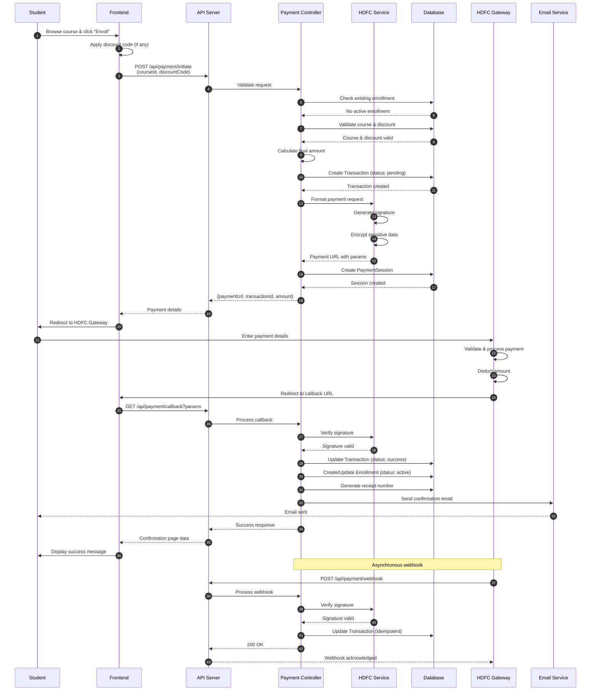

---

### 2. Payment Failure Flow

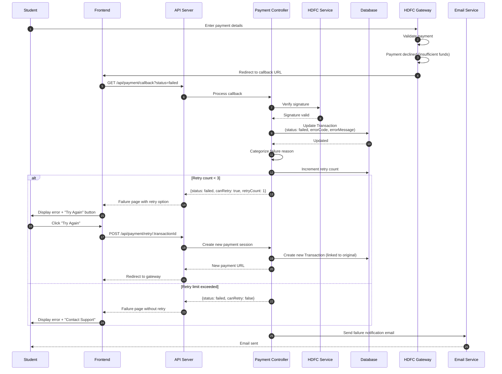

---

### 3. Refund Processing Flow

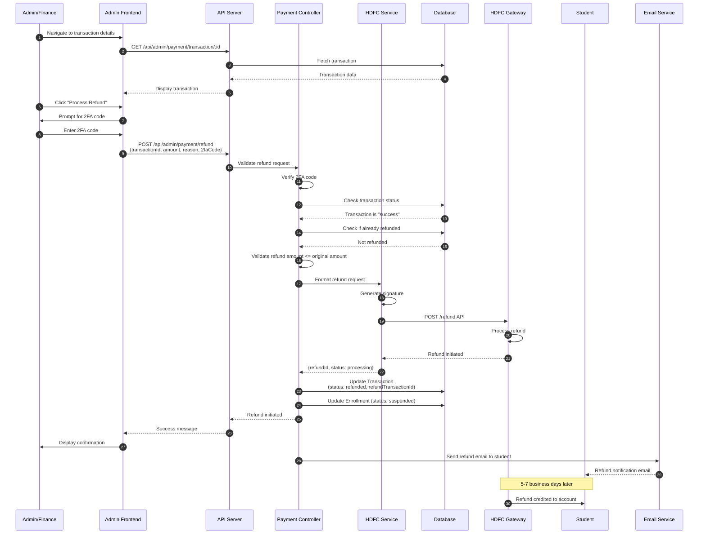

---

### 4. Webhook Processing Flow

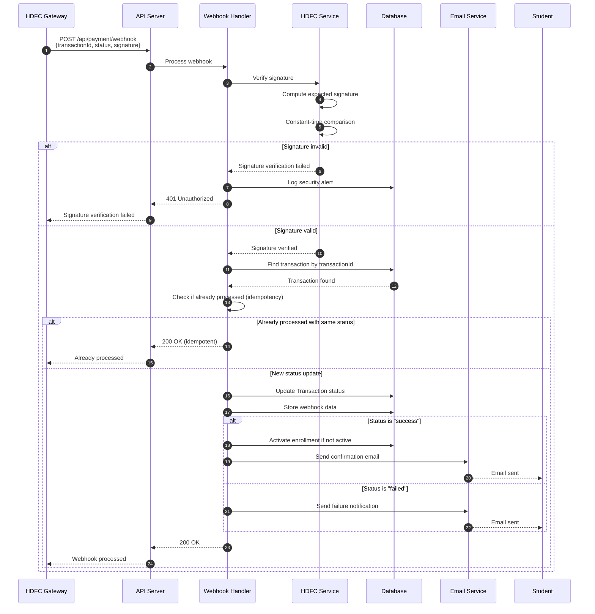

---

### 5. Reconciliation Flow

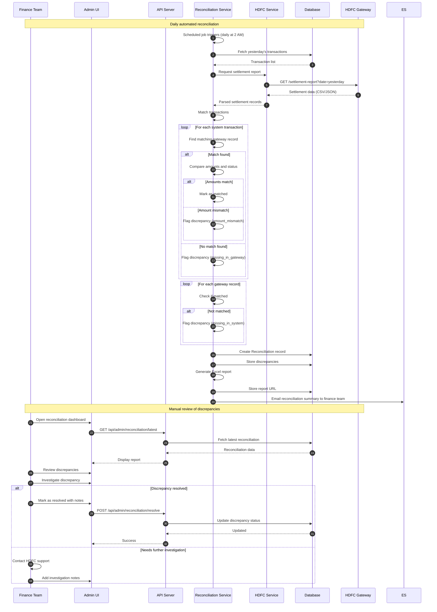

---

### 6. Session Expiration Flow

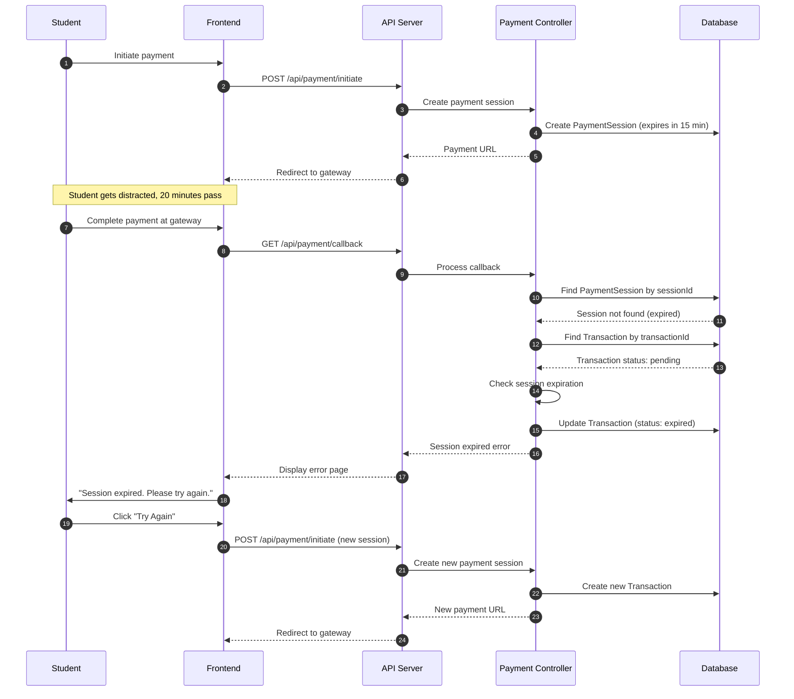

---

### 7. Discount Code Application Flow

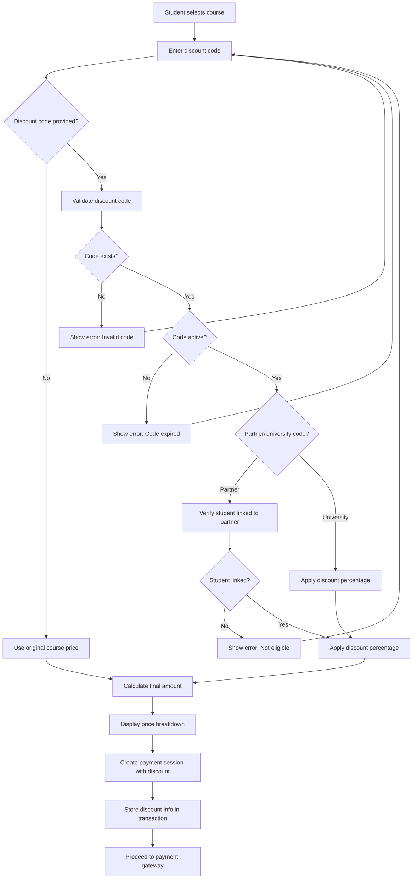

