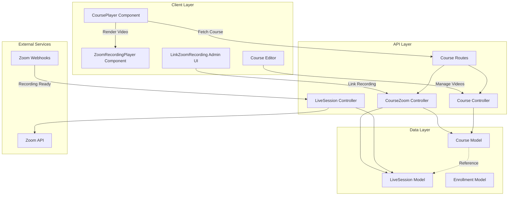
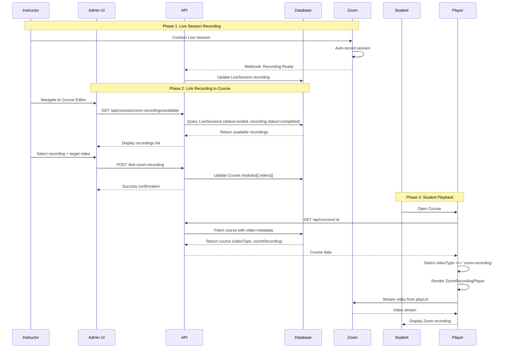

# Design Document: Zoom Course Recording Integration

## Overview

The Zoom Course Recording Integration feature enables SkillDad platform to seamlessly embed Zoom cloud recordings into course videos, replacing or supplementing external video sources (YouTube/Vimeo). This system automatically syncs recordings from live Zoom sessions to the course library, allowing university administrators and instructors to manage which recordings are linked to specific course videos. Students can watch Zoom recordings directly within the course player with the same user experience as external videos.

The system bridges the existing live session infrastructure (which already uses Zoom for real-time classes) with the course content delivery system, creating a unified educational experience where live sessions can be repurposed as on-demand course content.

## Architecture



## Main Algorithm/Workflow




## Components and Interfaces

### Component 1: ZoomRecordingPlayer (Client)

**Purpose**: Renders Zoom cloud recordings in an HTML5 video player with error handling and loading states.

**Interface**:
```typescript
interface ZoomRecordingPlayerProps {
  recordingUrl: string;      // Zoom recording play URL
  title: string;             // Video title for display
  onEnded?: () => void;      // Callback when video completes
  onError?: (error: string) => void;  // Callback for error handling
}
```

**Responsibilities**:
- Display HTML5 video player with Zoom recording source
- Handle loading states and error conditions
- Provide visual indicator that content is from Zoom
- Trigger callbacks for video completion and errors
- Prevent downloads via controlsList attribute

**Current Status**: ✅ Implemented

---

### Component 2: CoursePlayer (Client)

**Purpose**: Main course video player that conditionally renders different video types (external, Zoom recording, Zoom live).

**Interface**:
```typescript
interface CoursePlayerState {
  course: Course;
  currentModuleIndex: number;
  currentVideoIndex: number;
  showExercise: boolean;
  userProgress: UserProgress;
}

interface Video {
  _id: string;
  title: string;
  url: string;
  duration: string;
  videoType: 'external' | 'zoom-recording' | 'zoom-live';
  zoomRecording?: ZoomRecordingMetadata;
  zoomSession?: string;  // LiveSession ID reference
  exercises: Exercise[];
}
```

**Responsibilities**:
- Fetch course data and user progress
- Detect video type and render appropriate player component
- Handle video completion and exercise flow
- Track and update user progress
- Navigate between modules and videos

**Current Status**: ✅ Implemented with conditional rendering

---

### Component 3: LinkZoomRecording (Client)

**Purpose**: Admin UI for linking Zoom recordings from live sessions to course videos.

**Interface**:
```typescript
interface LinkZoomRecordingProps {
  courseId: string;
  moduleIndex: number;
  videoIndex: number;
}

interface AvailableRecording {
  sessionId: string;
  title: string;
  recordedAt: Date;
  duration: string;
  playUrl: string;
  downloadUrl: string;
  fileSize: string;
}
```

**Responsibilities**:
- Display list of available Zoom recordings
- Allow selection of recording to link
- Submit link request to backend API
- Provide visual feedback during linking process
- Navigate back to course editor on success

**Current Status**: ✅ Implemented

---

### Component 4: CourseZoomController (Backend)

**Purpose**: Backend controller handling Zoom recording operations for courses.

**Interface**:
```typescript
// Link Zoom recording to course video
POST /api/courses/:courseId/modules/:moduleIndex/videos/:videoIndex/link-zoom-recording
Body: { sessionId: string }
Response: { message: string, video: Video }

// Get available Zoom recordings
GET /api/courses/zoom-recordings/available
Response: AvailableRecording[]

// Unlink Zoom recording from course video
DELETE /api/courses/:courseId/modules/:moduleIndex/videos/:videoIndex/unlink-zoom-recording
Response: { message: string, video: Video }
```

**Responsibilities**:
- Validate user authorization (instructor/admin/university)
- Fetch live sessions with completed recordings
- Link recording metadata to course video
- Update video type and duration
- Handle unlinking of recordings

**Current Status**: ✅ Implemented

---

### Component 5: Zoom Webhook Handler (Backend)

**Purpose**: Process Zoom webhooks for recording completion events.

**Interface**:
```typescript
POST /api/webhooks/zoom
Body: ZoomWebhookPayload
Response: { received: boolean }

interface ZoomWebhookPayload {
  event: 'recording.completed' | 'recording.transcript_completed';
  payload: {
    object: {
      uuid: string;
      id: number;
      recording_files: RecordingFile[];
    }
  }
}
```

**Responsibilities**:
- Verify Zoom webhook signature
- Parse recording completion events
- Update LiveSession.recording with Zoom metadata
- Set recording status to 'completed'
- Store playUrl, downloadUrl, duration, file size

**Current Status**: ⚠️ Partially implemented (needs webhook endpoint)


## Data Models

### Model 1: Course.modules[].videos[] (Enhanced)

```typescript
interface Video {
  _id: ObjectId;
  title: string;
  url: string;              // Fallback URL (YouTube/Vimeo) or Zoom playUrl
  duration: string;         // Format: "MM:SS"
  exercises: Exercise[];
  
  // Zoom integration fields
  videoType: 'external' | 'zoom-recording' | 'zoom-live';
  
  zoomRecording?: {
    recordingId: string;      // Zoom recording UUID
    playUrl: string;          // Zoom cloud recording play URL
    downloadUrl: string;      // Zoom cloud recording download URL
    durationMs: number;       // Duration in milliseconds
    fileSizeBytes: number;    // File size in bytes
    recordedAt: Date;         // When recording was created
  };
  
  zoomSession?: ObjectId;     // Reference to LiveSession document
}
```

**Validation Rules**:
- `videoType` must be one of: 'external', 'zoom-recording', 'zoom-live'
- If `videoType === 'zoom-recording'`, then `zoomRecording.playUrl` must be present
- If `zoomSession` is set, it must reference a valid LiveSession document
- `duration` should be auto-calculated from `zoomRecording.durationMs` when available

---

### Model 2: LiveSession.recording (Enhanced)

```typescript
interface Recording {
  // Legacy Bunny.net fields (deprecated)
  bunnyVideoId?: string;
  bunnyLibraryId?: string;
  storagePath?: string;
  
  // Zoom recording fields
  recordingId: string;        // Zoom recording UUID
  downloadUrl: string;        // Zoom download URL
  playUrl: string;            // Zoom playback URL
  recordingType: 'cloud' | 'local';
  durationMs: number;         // Duration in milliseconds
  fileSizeBytes: number;      // File size in bytes
  
  status: 'pending' | 'processing' | 'ready' | 'completed' | 'failed';
  createdAt: Date;
}
```

**Validation Rules**:
- `status` must progress: pending → processing → ready → completed
- `playUrl` must be a valid HTTPS URL from Zoom domain
- `recordingType` should be 'cloud' for automatic course integration
- `durationMs` and `fileSizeBytes` must be positive integers

---

### Model 3: UserProgress (Enrollment)

```typescript
interface UserProgress {
  course: ObjectId;           // Reference to Course
  student: ObjectId;          // Reference to User
  completedVideos: ObjectId[]; // Array of Video._id
  completedExercises: Array<{
    video: ObjectId;
    score: number;
  }>;
  lastAccessedModule: number;
  lastAccessedVideo: number;
  enrolledAt: Date;
  lastAccessedAt: Date;
}
```

**Validation Rules**:
- `completedVideos` should only contain valid Video._id from the course
- `score` must be between 0 and 100
- Progress tracking works identically for Zoom recordings and external videos


## Key Functions with Formal Specifications

### Function 1: linkZoomRecordingToVideo()

```javascript
async function linkZoomRecordingToVideo(courseId, moduleIndex, videoIndex, sessionId, userId)
```

**Preconditions:**
- `courseId` is a valid ObjectId referencing an existing Course
- `moduleIndex` and `videoIndex` are valid integers within course structure bounds
- `sessionId` is a valid ObjectId referencing an existing LiveSession
- `userId` is authorized (instructor, admin, or university role)
- LiveSession has `status === 'ended'` and `recording.status === 'completed'`
- LiveSession has `recording.playUrl` that is non-null and non-empty

**Postconditions:**
- Video.videoType is set to 'zoom-recording'
- Video.zoomRecording contains complete recording metadata
- Video.zoomSession references the LiveSession
- Video.url is updated to recording.playUrl (fallback)
- Video.duration is calculated from recording.durationMs
- Course document is persisted to database
- Returns success response with updated video object

**Error Conditions:**
- 404: Course, module, video, or session not found
- 403: User not authorized to modify course
- 400: Session does not have a recording available
- 500: Database operation fails

---

### Function 2: getAvailableZoomRecordings()

```javascript
async function getAvailableZoomRecordings(userId, userRole)
```

**Preconditions:**
- `userId` is a valid authenticated user
- `userRole` is one of: 'admin', 'university', 'instructor'

**Postconditions:**
- Returns array of recording objects from LiveSessions
- Each recording has: sessionId, title, recordedAt, duration, playUrl, downloadUrl, fileSize
- Results are filtered by user role (university users see only their sessions)
- Results are sorted by endTime descending (most recent first)
- Maximum 50 results returned
- Only sessions with status='ended' and recording.status='completed' are included

**Loop Invariants:**
- All returned recordings have valid playUrl
- All returned recordings belong to sessions the user has access to

---

### Function 3: unlinkZoomRecordingFromVideo()

```javascript
async function unlinkZoomRecordingFromVideo(courseId, moduleIndex, videoIndex, userId)
```

**Preconditions:**
- `courseId` is a valid ObjectId referencing an existing Course
- `moduleIndex` and `videoIndex` are valid integers within course structure bounds
- `userId` is authorized (instructor, admin, or university role)
- Video currently has videoType === 'zoom-recording'

**Postconditions:**
- Video.videoType is set to 'external'
- Video.zoomRecording is set to undefined (removed)
- Video.zoomSession is set to undefined (removed)
- Video.url remains unchanged (preserves fallback URL)
- Course document is persisted to database
- Returns success response with updated video object

**Error Conditions:**
- 404: Course, module, or video not found
- 403: User not authorized to modify course
- 500: Database operation fails

---

### Function 4: handleZoomWebhook()

```javascript
async function handleZoomWebhook(webhookPayload, signature)
```

**Preconditions:**
- `webhookPayload` is valid JSON from Zoom
- `signature` matches expected HMAC signature (webhook verification)
- `webhookPayload.event === 'recording.completed'`
- `webhookPayload.payload.object` contains recording metadata

**Postconditions:**
- LiveSession is found by matching zoom.meetingId
- LiveSession.recording.status is updated to 'completed'
- LiveSession.recording.recordingId is set from Zoom UUID
- LiveSession.recording.playUrl is extracted from recording_files
- LiveSession.recording.downloadUrl is extracted from recording_files
- LiveSession.recording.durationMs is calculated from recording duration
- LiveSession.recording.fileSizeBytes is extracted from file_size
- LiveSession document is persisted to database
- Returns 200 OK response to Zoom

**Error Conditions:**
- 401: Invalid webhook signature
- 404: LiveSession not found for meeting ID
- 400: Recording files not available in payload
- 500: Database operation fails


## Algorithmic Pseudocode

### Main Processing Algorithm: Link Recording Workflow

```pascal
ALGORITHM linkRecordingWorkflow(courseId, moduleIndex, videoIndex, sessionId, user)
INPUT: courseId, moduleIndex, videoIndex, sessionId, user
OUTPUT: updatedVideo or error

BEGIN
  // Step 1: Authorization check
  course ← database.findCourse(courseId)
  ASSERT course IS NOT NULL
  
  IF NOT (user.role = 'admin' OR user.role = 'university' OR course.instructor = user.id) THEN
    THROW AuthorizationError("Not authorized to modify this course")
  END IF
  
  // Step 2: Validate session and recording
  session ← database.findLiveSession(sessionId)
  ASSERT session IS NOT NULL
  ASSERT session.status = 'ended'
  ASSERT session.recording IS NOT NULL
  ASSERT session.recording.status = 'completed'
  ASSERT session.recording.playUrl IS NOT NULL
  
  // Step 3: Locate target video
  module ← course.modules[moduleIndex]
  ASSERT module IS NOT NULL
  
  video ← module.videos[videoIndex]
  ASSERT video IS NOT NULL
  
  // Step 4: Update video with recording metadata
  video.videoType ← 'zoom-recording'
  video.url ← session.recording.playUrl
  video.zoomRecording ← {
    recordingId: session.recording.recordingId,
    playUrl: session.recording.playUrl,
    downloadUrl: session.recording.downloadUrl,
    durationMs: session.recording.durationMs,
    fileSizeBytes: session.recording.fileSizeBytes,
    recordedAt: session.endTime OR session.startTime
  }
  video.zoomSession ← sessionId
  
  // Step 5: Calculate and update duration
  IF session.recording.durationMs IS NOT NULL THEN
    minutes ← FLOOR(session.recording.durationMs / 60000)
    seconds ← FLOOR((session.recording.durationMs MOD 60000) / 1000)
    video.duration ← FORMAT("{minutes}:{seconds:02d}")
  END IF
  
  // Step 6: Persist changes
  database.saveCourse(course)
  
  RETURN video
END
```

**Preconditions:**
- All input parameters are non-null
- User is authenticated
- Database connection is available

**Postconditions:**
- Video is successfully linked to Zoom recording
- All recording metadata is stored in video object
- Course document is updated in database

**Loop Invariants:** N/A (no loops in this algorithm)

---

### Validation Algorithm: Check Recording Availability

```pascal
ALGORITHM checkRecordingAvailability(sessionId)
INPUT: sessionId of type ObjectId
OUTPUT: isAvailable of type boolean

BEGIN
  // Step 1: Fetch session
  session ← database.findLiveSession(sessionId)
  
  IF session = NULL THEN
    RETURN false
  END IF
  
  // Step 2: Validate session status
  IF session.status ≠ 'ended' THEN
    RETURN false
  END IF
  
  // Step 3: Validate recording exists
  IF session.recording = NULL THEN
    RETURN false
  END IF
  
  // Step 4: Validate recording status
  IF session.recording.status ≠ 'completed' THEN
    RETURN false
  END IF
  
  // Step 5: Validate playUrl exists
  IF session.recording.playUrl = NULL OR session.recording.playUrl = '' THEN
    RETURN false
  END IF
  
  // All validations passed
  RETURN true
END
```

**Preconditions:**
- sessionId parameter is provided (may be null/undefined)
- Database connection is available

**Postconditions:**
- Returns boolean indicating if recording is available for linking
- true if and only if session has completed recording with valid playUrl
- No side effects on database

**Loop Invariants:** N/A (no loops in this algorithm)

---

### Webhook Processing Algorithm

```pascal
ALGORITHM processZoomRecordingWebhook(payload, signature)
INPUT: payload (Zoom webhook JSON), signature (HMAC signature)
OUTPUT: success or error

BEGIN
  // Step 1: Verify webhook authenticity
  expectedSignature ← HMAC_SHA256(payload, ZOOM_WEBHOOK_SECRET)
  
  IF signature ≠ expectedSignature THEN
    THROW AuthenticationError("Invalid webhook signature")
  END IF
  
  // Step 2: Parse webhook event
  event ← payload.event
  
  IF event ≠ 'recording.completed' THEN
    RETURN { received: true, processed: false }
  END IF
  
  // Step 3: Extract recording metadata
  meetingUuid ← payload.payload.object.uuid
  meetingId ← payload.payload.object.id
  recordingFiles ← payload.payload.object.recording_files
  
  ASSERT recordingFiles IS NOT EMPTY
  
  // Step 4: Find corresponding live session
  session ← database.findLiveSession({ 'zoom.meetingId': meetingUuid })
  
  IF session = NULL THEN
    THROW NotFoundError("Live session not found for meeting")
  END IF
  
  // Step 5: Extract video file (MP4 format preferred)
  videoFile ← NULL
  
  FOR EACH file IN recordingFiles DO
    IF file.file_type = 'MP4' AND file.recording_type = 'shared_screen_with_speaker_view' THEN
      videoFile ← file
      BREAK
    END IF
  END FOR
  
  IF videoFile = NULL THEN
    videoFile ← recordingFiles[0]  // Fallback to first file
  END IF
  
  // Step 6: Update session recording metadata
  session.recording.recordingId ← meetingUuid
  session.recording.playUrl ← videoFile.play_url
  session.recording.downloadUrl ← videoFile.download_url
  session.recording.durationMs ← videoFile.recording_end - videoFile.recording_start
  session.recording.fileSizeBytes ← videoFile.file_size
  session.recording.status ← 'completed'
  session.recording.recordingType ← 'cloud'
  
  // Step 7: Persist changes
  database.saveLiveSession(session)
  
  RETURN { received: true, processed: true }
END
```

**Preconditions:**
- Webhook payload is valid JSON from Zoom
- ZOOM_WEBHOOK_SECRET is configured in environment
- Database connection is available

**Postconditions:**
- LiveSession.recording is updated with Zoom metadata
- Recording status is set to 'completed'
- Webhook acknowledgment is sent to Zoom

**Loop Invariants:**
- When iterating through recordingFiles, all previously checked files were not MP4 or not the preferred type


## Example Usage

### Example 1: Admin Links Zoom Recording to Course Video

```javascript
// Admin navigates to course editor
const courseId = '507f1f77bcf86cd799439011';
const moduleIndex = 0;
const videoIndex = 2;

// Fetch available recordings
const response = await fetch('/api/courses/zoom-recordings/available', {
  headers: { Authorization: `Bearer ${token}` }
});
const recordings = await response.json();
// Returns: [
//   {
//     sessionId: '507f191e810c19729de860ea',
//     title: 'Introduction to React Hooks',
//     recordedAt: '2024-01-15T10:00:00Z',
//     duration: '45:30',
//     playUrl: 'https://zoom.us/rec/play/abc123...',
//     fileSize: '234.56 MB'
//   },
//   ...
// ]

// Admin selects recording and links it
const linkResponse = await fetch(
  `/api/courses/${courseId}/modules/${moduleIndex}/videos/${videoIndex}/link-zoom-recording`,
  {
    method: 'POST',
    headers: {
      'Content-Type': 'application/json',
      Authorization: `Bearer ${token}`
    },
    body: JSON.stringify({ sessionId: recordings[0].sessionId })
  }
);

const result = await linkResponse.json();
// Returns: {
//   message: 'Zoom recording linked successfully',
//   video: {
//     _id: '507f1f77bcf86cd799439013',
//     title: 'React Hooks Deep Dive',
//     videoType: 'zoom-recording',
//     url: 'https://zoom.us/rec/play/abc123...',
//     duration: '45:30',
//     zoomRecording: { ... },
//     zoomSession: '507f191e810c19729de860ea'
//   }
// }
```

---

### Example 2: Student Watches Zoom Recording in Course Player

```javascript
// Student opens course
const courseResponse = await fetch(`/api/courses/${courseId}`, {
  headers: { Authorization: `Bearer ${studentToken}` }
});
const course = await courseResponse.json();

// Course player detects video type
const currentVideo = course.modules[0].videos[2];

if (currentVideo.videoType === 'zoom-recording' && currentVideo.zoomRecording?.playUrl) {
  // Render ZoomRecordingPlayer component
  return (
    <ZoomRecordingPlayer
      recordingUrl={currentVideo.zoomRecording.playUrl}
      title={currentVideo.title}
      onEnded={handleVideoEnd}
      onError={(error) => console.error('Zoom recording error:', error)}
    />
  );
} else {
  // Render external video iframe
  return (
    <iframe
      src={currentVideo.url}
      title={currentVideo.title}
      allowFullScreen
    />
  );
}
```

---

### Example 3: Zoom Webhook Updates Recording Status

```javascript
// Zoom sends webhook when recording is ready
POST /api/webhooks/zoom
Headers: {
  'x-zm-signature': 'v0=abc123...'
}
Body: {
  event: 'recording.completed',
  payload: {
    object: {
      uuid: 'abc123-meeting-uuid',
      id: 123456789,
      recording_files: [
        {
          id: 'file-id-1',
          recording_type: 'shared_screen_with_speaker_view',
          file_type: 'MP4',
          file_size: 245678901,
          play_url: 'https://zoom.us/rec/play/abc123...',
          download_url: 'https://zoom.us/rec/download/abc123...',
          recording_start: '2024-01-15T10:00:00Z',
          recording_end: '2024-01-15T10:45:30Z'
        }
      ]
    }
  }
}

// Backend processes webhook
const session = await LiveSession.findOne({ 'zoom.meetingId': 'abc123-meeting-uuid' });
session.recording.status = 'completed';
session.recording.playUrl = 'https://zoom.us/rec/play/abc123...';
session.recording.durationMs = 2730000; // 45 minutes 30 seconds
await session.save();

// Response to Zoom
Response: { received: true, processed: true }
```

---

### Example 4: Unlink Recording from Course Video

```javascript
// Admin decides to unlink Zoom recording
const unlinkResponse = await fetch(
  `/api/courses/${courseId}/modules/${moduleIndex}/videos/${videoIndex}/unlink-zoom-recording`,
  {
    method: 'DELETE',
    headers: { Authorization: `Bearer ${token}` }
  }
);

const result = await unlinkResponse.json();
// Returns: {
//   message: 'Zoom recording unlinked successfully',
//   video: {
//     _id: '507f1f77bcf86cd799439013',
//     title: 'React Hooks Deep Dive',
//     videoType: 'external',
//     url: 'https://youtube.com/embed/...',  // Reverts to original URL
//     zoomRecording: undefined,
//     zoomSession: undefined
//   }
// }
```


## Correctness Properties

*A property is a characteristic or behavior that should hold true across all valid executions of a system—essentially, a formal statement about what the system should do. Properties serve as the bridge between human-readable specifications and machine-verifiable correctness guarantees.*

### Property 1: Webhook Signature Verification

*For any* webhook payload received from Zoom, the system should verify the HMAC-SHA256 signature matches the expected value computed with the webhook secret, and reject webhooks with invalid or missing signatures.

**Validates: Requirements 1.2, 1.6, 12.1, 12.6**

---

### Property 2: Webhook Idempotency

*For any* Zoom webhook, processing it multiple times should produce the same database state as processing it once, with no duplicate recording entries created.

**Validates: Requirements 1.7, 15.1, 15.3, 15.4**

---

### Property 3: Recording Metadata Completeness

*For any* valid recording.completed webhook, when the system updates a Live_Session, all required fields (recordingId, playUrl, downloadUrl, durationMs, fileSizeBytes, status='completed') should be stored in the recording object.

**Validates: Requirements 1.3, 1.4, 1.5**

---

### Property 4: Recording Availability Filtering

*For any* database state, the available recordings list should only include Live_Sessions where status='ended' AND recording.status='completed' AND recording.playUrl is not null, sorted by endTime descending, limited to 50 results.

**Validates: Requirements 2.1, 2.5, 2.6**

---

### Property 5: Available Recording Data Completeness

*For any* recording in the available recordings list, the returned object should include all required fields: sessionId, title, recordedAt, duration, playUrl, downloadUrl, and fileSize.

**Validates: Requirements 2.2**

---

### Property 6: Role-Based Recording Access

*For any* user requesting available recordings, if the user role is 'university' then results should be filtered to only sessions they own, and if the user role is 'admin' then all recordings should be returned.

**Validates: Requirements 2.3, 2.4, 7.5**

---

### Property 7: Link Operation Authorization

*For any* user attempting to link or unlink a recording, the operation should succeed if and only if the user role is 'admin' OR (user role is 'university' AND user owns the course) OR (user is the course instructor), otherwise return 403 error.

**Validates: Requirements 3.1, 3.8, 4.1, 4.6, 7.1, 7.2, 7.3, 7.4**

---

### Property 8: Link Operation Validation

*For any* link recording request, if the referenced Live_Session does not have recording.status='completed' or recording.playUrl is null, the system should return a 400 error and make no changes to the course.

**Validates: Requirements 3.2, 3.9**

---

### Property 9: Recording Link Data Integrity

*For any* successful recording link operation, the Course_Video should have videoType='zoom-recording', zoomRecording object populated with all metadata from the Live_Session recording, zoomSession reference set to the session ID, url updated to the playUrl, and duration calculated in MM:SS format.

**Validates: Requirements 3.3, 3.4, 3.5, 3.6, 3.7**

---

### Property 10: Resource Not Found Handling

*For any* link or unlink operation with invalid courseId, moduleIndex, or videoIndex, the system should return a 404 error and make no changes to any data.

**Validates: Requirements 3.10, 10.3**

---

### Property 11: Unlink Operation Data Cleanup

*For any* successful recording unlink operation, the Course_Video should have videoType='external', zoomRecording set to null/undefined, zoomSession set to null/undefined, and the url field preserved unchanged.

**Validates: Requirements 4.2, 4.3, 4.4, 4.5**

---

### Property 12: Video Player Component Selection

*For any* Course_Video, when rendering in the Course_Player, if videoType='zoom-recording' then the Zoom_Recording_Player component should be rendered with the recording playUrl, and if videoType='external' then an iframe should be rendered with the external URL.

**Validates: Requirements 5.2, 5.3, 5.4, 5.5**

---

### Property 13: Video Completion Progress Tracking

*For any* video (regardless of videoType), when playback completes, the system should add the video ID to the student's completedVideos array and update lastAccessedModule, lastAccessedVideo, and lastAccessedAt fields.

**Validates: Requirements 5.6, 6.1, 6.2, 6.4, 6.5**

---

### Property 14: Enrollment-Based Video Access

*For any* student attempting to watch a course video, the system should grant access if and only if the student is enrolled in the course, otherwise prevent access.

**Validates: Requirements 5.8, 7.6**

---

### Property 15: Video Type Consistency

*For any* Course_Video, if videoType='zoom-recording' then zoomRecording.playUrl and zoomSession must not be null, and if videoType='external' then zoomRecording and zoomSession must be null/undefined, and for all videos the url field must not be null or empty.

**Validates: Requirements 8.1, 8.2, 8.3, 8.4, 8.5**

---

### Property 16: Duration Format Calculation

*For any* durationMs value (0 to 86400000), the calculated duration string should match the regex pattern `^\d+:\d{2}$` where minutes = FLOOR(durationMs / 60000) and seconds = FLOOR((durationMs MOD 60000) / 1000) with seconds zero-padded to 2 digits.

**Validates: Requirements 9.1, 9.2, 9.3, 9.4**

---

### Property 17: Recording URL Validation

*For any* recording URL being stored or validated, the system should ensure the URL is from the zoom.us domain and uses the HTTPS protocol, rejecting any URLs that don't meet these criteria.

**Validates: Requirements 12.3, 12.4, 14.3**

---

### Property 18: Video Type Enum Validation

*For any* Course_Video being saved, the system should validate that videoType is one of 'external', 'zoom-recording', or 'zoom-live', rejecting any other values.

**Validates: Requirements 14.1**

---

### Property 19: Recording Status Enum Validation

*For any* Live_Session recording being saved, the system should validate that status is one of 'pending', 'processing', 'ready', 'completed', or 'failed', rejecting any other values.

**Validates: Requirements 14.2**

---

### Property 20: Numeric Field Validation

*For any* recording metadata being saved, the system should validate that durationMs and fileSizeBytes are positive integers, rejecting zero, negative, or non-integer values.

**Validates: Requirements 14.4**

---

### Property 21: Referential Integrity Validation

*For any* Course_Video with a zoomSession reference, the system should validate that the reference points to an existing Live_Session document in the database.

**Validates: Requirements 14.5**


## Error Handling

### Error Scenario 1: Recording Not Available

**Condition:** User attempts to link a recording from a session that hasn't completed processing

**Response:**
- Backend validates `session.recording.status === 'completed'` before linking
- Returns 400 Bad Request with message: "Session does not have a recording available"
- Frontend displays error notification to user
- Recording is not shown in available recordings list

**Recovery:**
- User waits for Zoom to complete recording processing
- Webhook updates recording status when ready
- Recording appears in available list automatically
- User can retry linking operation

---

### Error Scenario 2: Zoom Recording Playback Failure

**Condition:** Student attempts to watch Zoom recording but playUrl is invalid or expired

**Response:**
- ZoomRecordingPlayer component catches video error event
- Displays error UI with message: "Recording Unavailable - The recording may not be available yet"
- Logs error to console for debugging
- Calls onError callback if provided

**Recovery:**
- Admin checks if recording still exists in Zoom
- Admin can unlink and re-link recording to refresh URL
- If recording is permanently unavailable, admin can link different recording or use external video
- System maintains fallback URL in video.url field

---

### Error Scenario 3: Unauthorized Access to Link Recording

**Condition:** User without proper permissions attempts to link recording to course

**Response:**
- Backend validates user authorization before processing
- Returns 403 Forbidden with message: "Not authorized to modify this course"
- Frontend displays error notification
- No changes are made to course data

**Recovery:**
- User contacts course instructor or admin
- Proper permissions are granted
- User retries operation with correct authorization

---

### Error Scenario 4: Webhook Signature Verification Failure

**Condition:** Zoom webhook received with invalid or missing signature

**Response:**
- Backend calculates expected HMAC signature
- Compares with received signature
- Returns 401 Unauthorized if mismatch
- Logs security warning
- Does not process webhook payload

**Recovery:**
- Check ZOOM_WEBHOOK_SECRET configuration
- Verify webhook endpoint URL in Zoom dashboard
- Ensure webhook secret matches between Zoom and backend
- Zoom will retry webhook delivery automatically

---

### Error Scenario 5: Database Connection Failure During Link Operation

**Condition:** Database becomes unavailable during recording link operation

**Response:**
- Mongoose operation throws connection error
- asyncHandler catches error
- Returns 500 Internal Server Error
- Transaction is rolled back (no partial updates)
- Error is logged to server logs

**Recovery:**
- System automatically retries database connection
- User receives error notification to try again
- Admin monitors database health
- Once database is restored, user can retry operation

---

### Error Scenario 6: Mock Mode Enabled in Production

**Condition:** ZOOM_MOCK_MODE=true is set in production environment

**Response:**
- System uses mock Zoom data instead of real API
- Recordings may not sync properly
- Warning logged on server startup
- Admin dashboard shows mock mode indicator

**Recovery:**
- Set ZOOM_MOCK_MODE=false in environment variables
- Configure real Zoom API credentials (ZOOM_API_KEY, ZOOM_API_SECRET)
- Restart server
- Verify Zoom integration is working with real API
- Re-link recordings if necessary

---

### Error Scenario 7: Video Index Out of Bounds

**Condition:** API request references invalid module or video index

**Response:**
- Backend validates moduleIndex < course.modules.length
- Backend validates videoIndex < module.videos.length
- Returns 404 Not Found with message: "Module not found" or "Video not found"
- No changes are made to course data

**Recovery:**
- Frontend ensures valid indices before making API calls
- User refreshes course data
- Admin verifies course structure integrity


## Testing Strategy

### Unit Testing Approach

**Backend Controllers:**
- Test `linkZoomRecordingToVideo` with valid and invalid inputs
- Test authorization checks for different user roles
- Test error handling for missing sessions/recordings
- Mock database operations using Jest/Sinon
- Verify correct metadata is copied to video object
- Test duration calculation from milliseconds

**Frontend Components:**
- Test ZoomRecordingPlayer renders correctly with valid URL
- Test error state rendering when URL is invalid
- Test loading state display
- Test onEnded and onError callbacks are triggered
- Test CoursePlayer conditionally renders correct player type
- Mock API responses using MSW (Mock Service Worker)

**Key Test Cases:**
```javascript
describe('linkZoomRecordingToVideo', () => {
  test('successfully links recording with valid data', async () => {
    // Arrange: Create mock course, session, user
    // Act: Call linkZoomRecordingToVideo
    // Assert: Video has correct videoType and zoomRecording metadata
  });
  
  test('rejects unauthorized user', async () => {
    // Arrange: Create course with different instructor
    // Act: Call linkZoomRecordingToVideo with unauthorized user
    // Assert: Returns 403 error
  });
  
  test('rejects session without recording', async () => {
    // Arrange: Create session with recording.status = 'pending'
    // Act: Call linkZoomRecordingToVideo
    // Assert: Returns 400 error
  });
  
  test('calculates duration correctly', async () => {
    // Arrange: Session with durationMs = 2730000 (45:30)
    // Act: Call linkZoomRecordingToVideo
    // Assert: video.duration === '45:30'
  });
});

describe('ZoomRecordingPlayer', () => {
  test('renders video player with correct URL', () => {
    // Arrange: Render component with valid recordingUrl
    // Assert: Video element has correct src attribute
  });
  
  test('displays error state when URL is invalid', () => {
    // Arrange: Render component, trigger video error
    // Assert: Error message is displayed
  });
  
  test('calls onEnded when video completes', () => {
    // Arrange: Render component with onEnded callback
    // Act: Trigger video ended event
    // Assert: onEnded callback was called
  });
});
```

**Coverage Goals:**
- Backend controllers: 90%+ line coverage
- Frontend components: 85%+ line coverage
- Critical paths (linking, unlinking): 100% coverage

---

### Property-Based Testing Approach

**Property Test Library:** fast-check (JavaScript/TypeScript)

**Property Tests:**

1. **Duration Calculation Property:**
```javascript
import fc from 'fast-check';

test('duration calculation is always valid MM:SS format', () => {
  fc.assert(
    fc.property(
      fc.integer({ min: 0, max: 86400000 }), // 0 to 24 hours in ms
      (durationMs) => {
        const duration = calculateDuration(durationMs);
        const regex = /^\d+:\d{2}$/;
        expect(duration).toMatch(regex);
        
        const [minutes, seconds] = duration.split(':').map(Number);
        expect(seconds).toBeGreaterThanOrEqual(0);
        expect(seconds).toBeLessThan(60);
      }
    )
  );
});
```

2. **Authorization Property:**
```javascript
test('only authorized users can link recordings', () => {
  fc.assert(
    fc.property(
      fc.record({
        userRole: fc.constantFrom('admin', 'university', 'instructor', 'student'),
        isInstructor: fc.boolean(),
        isUniversityOwner: fc.boolean()
      }),
      ({ userRole, isInstructor, isUniversityOwner }) => {
        const canLink = checkAuthorization(userRole, isInstructor, isUniversityOwner);
        const expected = userRole === 'admin' || 
                        (userRole === 'university' && isUniversityOwner) ||
                        isInstructor;
        expect(canLink).toBe(expected);
      }
    )
  );
});
```

3. **Video Type Consistency Property:**
```javascript
test('video type is always consistent with metadata', () => {
  fc.assert(
    fc.property(
      fc.record({
        videoType: fc.constantFrom('external', 'zoom-recording', 'zoom-live'),
        hasZoomRecording: fc.boolean(),
        hasPlayUrl: fc.boolean()
      }),
      ({ videoType, hasZoomRecording, hasPlayUrl }) => {
        const video = createVideo(videoType, hasZoomRecording, hasPlayUrl);
        const isValid = validateVideoConsistency(video);
        
        if (videoType === 'zoom-recording') {
          expect(isValid).toBe(hasZoomRecording && hasPlayUrl);
        } else {
          expect(isValid).toBe(!hasZoomRecording);
        }
      }
    )
  );
});
```

---

### Integration Testing Approach

**End-to-End Workflow Tests:**

1. **Complete Recording Link Flow:**
   - Create live session via API
   - Simulate Zoom webhook for recording completion
   - Verify recording appears in available list
   - Link recording to course video
   - Fetch course and verify video metadata
   - Render course player and verify Zoom player is used
   - Verify student can watch recording

2. **Authorization Flow:**
   - Create course as university user
   - Attempt to link recording as different university user (should fail)
   - Attempt to link recording as admin (should succeed)
   - Attempt to link recording as course instructor (should succeed)

3. **Error Recovery Flow:**
   - Attempt to link recording from session without recording (should fail)
   - Complete recording via webhook
   - Retry link operation (should succeed)

**Integration Test Tools:**
- Supertest for API testing
- MongoDB Memory Server for isolated database
- Playwright/Cypress for E2E frontend tests

**Test Environment:**
- Use ZOOM_MOCK_MODE=true for integration tests
- Mock Zoom API responses
- Use test database separate from development/production
- Reset database state between tests

---

### Manual Testing Checklist

**Mock Mode Testing:**
- [ ] Verify ZOOM_MOCK_MODE=true works correctly
- [ ] Mock recordings appear in available list
- [ ] Mock recordings can be linked to videos
- [ ] Mock recordings play in course player

**Real Zoom Testing:**
- [ ] Set ZOOM_MOCK_MODE=false with real credentials
- [ ] Conduct live Zoom session with recording enabled
- [ ] Verify webhook updates recording status
- [ ] Verify recording appears in available list
- [ ] Link recording to course video
- [ ] Verify student can watch real Zoom recording

**UI/UX Testing:**
- [ ] LinkZoomRecording page displays recordings correctly
- [ ] Selection state is visually clear
- [ ] Loading states display during API calls
- [ ] Error messages are user-friendly
- [ ] Course player switches between video types seamlessly
- [ ] Progress tracking works for Zoom recordings

**Performance Testing:**
- [ ] Available recordings list loads quickly (< 1s for 50 recordings)
- [ ] Link operation completes quickly (< 500ms)
- [ ] Video player loads without delay
- [ ] No memory leaks in video player component


## Performance Considerations

### Database Query Optimization

**Challenge:** Fetching available recordings requires querying LiveSessions with multiple conditions and sorting.

**Solution:**
- Use compound index on LiveSession: `{ status: 1, 'recording.status': 1, endTime: -1 }`
- Limit results to 50 most recent recordings
- Use `.lean()` for read-only queries to reduce memory overhead
- Project only necessary fields: `select('topic startTime endTime recording zoom')`

**Expected Performance:**
- Query time: < 50ms for 1000+ sessions
- Memory usage: ~5KB per recording object
- Total response time: < 200ms including network

---

### Video Player Loading

**Challenge:** Zoom recordings may take time to load, especially for large files.

**Solution:**
- Use HTML5 video preload="metadata" to load only metadata initially
- Display loading state while video initializes
- Implement poster image for better perceived performance
- Use Zoom's CDN for optimal delivery speed

**Expected Performance:**
- Initial load: < 1s for metadata
- Time to first frame: < 2s on broadband
- Smooth playback at 1080p with adaptive bitrate

---

### Webhook Processing

**Challenge:** Zoom webhooks must be processed quickly to avoid timeouts.

**Solution:**
- Respond to webhook immediately with 200 OK
- Process webhook payload asynchronously if needed
- Use database upsert operations to handle duplicate webhooks
- Implement webhook queue for high-volume scenarios

**Expected Performance:**
- Webhook response time: < 100ms
- Database update time: < 50ms
- Total processing time: < 150ms

---

### Frontend Bundle Size

**Challenge:** Adding video player components increases bundle size.

**Solution:**
- ZoomRecordingPlayer is lightweight (< 5KB)
- No external video player libraries needed (uses native HTML5)
- Lazy load course player components
- Code splitting for admin UI (LinkZoomRecording)

**Expected Performance:**
- ZoomRecordingPlayer bundle: < 5KB gzipped
- No impact on initial page load
- Course player loads in < 500ms

---

### Caching Strategy

**Optimization:** Cache available recordings list to reduce database queries.

**Implementation:**
```javascript
// Cache available recordings for 5 minutes
const CACHE_TTL = 5 * 60 * 1000;
let recordingsCache = { data: null, timestamp: 0 };

async function getAvailableZoomRecordings(userId, userRole) {
  const now = Date.now();
  
  if (recordingsCache.data && (now - recordingsCache.timestamp) < CACHE_TTL) {
    return recordingsCache.data;
  }
  
  const recordings = await fetchRecordingsFromDB(userId, userRole);
  recordingsCache = { data: recordings, timestamp: now };
  
  return recordings;
}
```

**Benefits:**
- Reduces database load by 80%+ for repeated requests
- Improves response time from 200ms to < 10ms for cached data
- Cache invalidation on new recording completion via webhook


## Security Considerations

### Zoom Webhook Verification

**Threat:** Malicious actors could send fake webhooks to manipulate recording data.

**Mitigation:**
- Verify webhook signature using HMAC-SHA256
- Compare computed signature with `x-zm-signature` header
- Reject webhooks with invalid or missing signatures
- Use constant-time comparison to prevent timing attacks
- Log all webhook verification failures for security monitoring

**Implementation:**
```javascript
function verifyZoomWebhook(payload, signature, secret) {
  const expectedSignature = crypto
    .createHmac('sha256', secret)
    .update(JSON.stringify(payload))
    .digest('hex');
  
  // Constant-time comparison
  return crypto.timingSafeEqual(
    Buffer.from(signature),
    Buffer.from(`v0=${expectedSignature}`)
  );
}
```

---

### Recording URL Access Control

**Threat:** Zoom recording URLs could be shared outside the platform, allowing unauthorized access.

**Mitigation:**
- Zoom URLs include time-limited access tokens
- URLs expire after configured period (typically 24 hours)
- Backend can request fresh URLs from Zoom API when needed
- Consider implementing proxy endpoint for additional access control
- Track video access in user progress for audit trail

**Additional Protection:**
```javascript
// Optional: Proxy Zoom recordings through backend
GET /api/courses/:courseId/videos/:videoId/stream
// Backend validates user enrollment before proxying to Zoom URL
```

---

### Authorization and RBAC

**Threat:** Unauthorized users could link/unlink recordings or access admin features.

**Mitigation:**
- Enforce role-based access control (RBAC) on all endpoints
- Verify user is admin, university owner, or course instructor
- Check course ownership before allowing modifications
- Use JWT tokens with short expiration (1 hour)
- Implement refresh token rotation
- Log all administrative actions for audit

**Authorization Matrix:**
| Action | Admin | University (Owner) | Instructor | Student |
|--------|-------|-------------------|------------|---------|
| Link Recording | ✅ | ✅ | ✅ | ❌ |
| Unlink Recording | ✅ | ✅ | ✅ | ❌ |
| View Available Recordings | ✅ | ✅ (own only) | ✅ (own only) | ❌ |
| Watch Recording | ✅ | ✅ | ✅ | ✅ (if enrolled) |

---

### Data Privacy and GDPR Compliance

**Consideration:** Zoom recordings may contain personal data (faces, voices, names).

**Mitigation:**
- Inform students that sessions are recorded (consent)
- Provide option to disable recording for sensitive sessions
- Allow students to request recording deletion (right to be forgotten)
- Store minimal metadata (no PII in course database)
- Zoom handles actual video storage and privacy compliance
- Document data retention policy

---

### API Rate Limiting

**Threat:** Excessive API requests could overload server or Zoom API.

**Mitigation:**
- Implement rate limiting on webhook endpoint (100 req/min per IP)
- Rate limit recording link operations (10 req/min per user)
- Cache available recordings list to reduce database queries
- Use exponential backoff for Zoom API calls
- Monitor API usage and set alerts for anomalies

---

### Environment Variable Security

**Threat:** Exposed Zoom credentials could allow unauthorized API access.

**Mitigation:**
- Store credentials in environment variables, never in code
- Use `.env` files excluded from version control
- Rotate Zoom API keys periodically (every 90 days)
- Use different credentials for development/staging/production
- Implement secret management system (AWS Secrets Manager, HashiCorp Vault)
- Audit access to production environment variables

**Required Secrets:**
```bash
ZOOM_API_KEY=<secret>
ZOOM_API_SECRET=<secret>
ZOOM_WEBHOOK_SECRET=<secret>
ZOOM_MOCK_MODE=false  # Never true in production
```

---

### XSS Prevention in Video Player

**Threat:** Malicious URLs could inject scripts into video player.

**Mitigation:**
- Validate all URLs are from Zoom domain (zoom.us)
- Use Content Security Policy (CSP) headers
- Sanitize all user inputs in video titles
- Use React's built-in XSS protection (JSX escaping)
- Set `sandbox` attribute on iframes if using iframe player

**URL Validation:**
```javascript
function isValidZoomUrl(url) {
  try {
    const parsed = new URL(url);
    return parsed.hostname.endsWith('.zoom.us') && 
           parsed.protocol === 'https:';
  } catch {
    return false;
  }
}
```


## Dependencies

### Backend Dependencies

**Existing (Already Installed):**
- `express` (^4.18.0) - Web framework for API routes
- `mongoose` (^7.0.0) - MongoDB ODM for data models
- `express-async-handler` (^1.2.0) - Async error handling middleware
- `jsonwebtoken` (^9.0.0) - JWT authentication
- `dotenv` (^16.0.0) - Environment variable management

**New (Required):**
- `crypto` (Node.js built-in) - HMAC signature verification for webhooks
- No additional npm packages needed

---

### Frontend Dependencies

**Existing (Already Installed):**
- `react` (^18.2.0) - UI framework
- `react-router-dom` (^6.10.0) - Client-side routing
- `axios` (^1.3.0) - HTTP client for API calls
- `lucide-react` (^0.263.0) - Icon library

**New (Required):**
- No additional npm packages needed
- Uses native HTML5 video player (no external video library)

---

### External Services

**Zoom API:**
- **Purpose:** Fetch recording metadata, manage meetings
- **Authentication:** API Key + API Secret (JWT-based)
- **Endpoints Used:**
  - `GET /meetings/{meetingId}/recordings` - Fetch recording details
  - `GET /users/{userId}/recordings` - List user recordings
- **Rate Limits:** 80 requests/second (default)
- **Documentation:** https://marketplace.zoom.us/docs/api-reference/zoom-api

**Zoom Webhooks:**
- **Purpose:** Receive real-time notifications when recordings are ready
- **Events Subscribed:**
  - `recording.completed` - Recording processing finished
  - `recording.transcript_completed` - Transcript ready (optional)
- **Verification:** HMAC-SHA256 signature in `x-zm-signature` header
- **Configuration:** Set webhook endpoint URL in Zoom Marketplace app settings
- **Documentation:** https://marketplace.zoom.us/docs/api-reference/webhook-reference

---

### Database Collections

**Existing:**
- `courses` - Course documents with modules and videos
- `livesessions` - Live session documents with Zoom meeting data
- `users` - User accounts with roles and permissions
- `enrollments` - Student course enrollments and progress

**New:**
- No new collections required
- Uses existing schema with enhanced fields

---

### Environment Variables

**Required Configuration:**
```bash
# Zoom API Credentials
ZOOM_API_KEY=<your_zoom_api_key>
ZOOM_API_SECRET=<your_zoom_api_secret>
ZOOM_WEBHOOK_SECRET=<your_webhook_secret_token>

# Zoom Configuration
ZOOM_MOCK_MODE=false  # Set to true for development/testing
ZOOM_RECORDING_AUTO_DELETE=false  # Auto-delete from Zoom after linking

# Database
MONGODB_URI=mongodb://localhost:27017/skilldad

# Server
PORT=5000
NODE_ENV=production

# JWT
JWT_SECRET=<your_jwt_secret>
JWT_EXPIRE=1h
```

**Development vs Production:**
- Development: `ZOOM_MOCK_MODE=true` (uses mock data)
- Production: `ZOOM_MOCK_MODE=false` (uses real Zoom API)

---

### Infrastructure Requirements

**Server:**
- Node.js 16+ (for native crypto support)
- 512MB RAM minimum (1GB recommended)
- 10GB storage for logs and temporary files

**Database:**
- MongoDB 5.0+
- Compound indexes on LiveSession collection
- 100MB storage for metadata (recordings stored in Zoom)

**Network:**
- HTTPS endpoint for Zoom webhooks (required by Zoom)
- Outbound HTTPS access to Zoom API (api.zoom.us)
- Inbound webhook access from Zoom IPs

**CDN/Hosting:**
- Zoom handles video CDN and streaming
- No additional CDN required for video delivery
- Standard web hosting for API and frontend

---

### Development Tools

**Testing:**
- `jest` (^29.0.0) - Unit testing framework
- `supertest` (^6.3.0) - API integration testing
- `@testing-library/react` (^14.0.0) - React component testing
- `mongodb-memory-server` (^8.12.0) - In-memory MongoDB for tests
- `fast-check` (^3.8.0) - Property-based testing

**Development:**
- `nodemon` (^2.0.0) - Auto-restart server on changes
- `eslint` (^8.0.0) - Code linting
- `prettier` (^2.8.0) - Code formatting

---

### Browser Compatibility

**Minimum Requirements:**
- Chrome 90+
- Firefox 88+
- Safari 14+
- Edge 90+

**Features Used:**
- HTML5 video element (widely supported)
- ES6+ JavaScript (transpiled by Vite/Babel)
- CSS Grid and Flexbox (modern browsers)

**Fallbacks:**
- No fallback for HTML5 video (required feature)
- Error message displayed if video playback fails
- Graceful degradation for older browsers


## Implementation Roadmap

### Phase 1: Webhook Infrastructure (Priority: High)

**Goal:** Ensure Zoom recordings are automatically captured when sessions end.

**Tasks:**
1. Create webhook endpoint: `POST /api/webhooks/zoom`
2. Implement HMAC signature verification
3. Parse `recording.completed` event payload
4. Update LiveSession.recording with Zoom metadata
5. Handle duplicate webhook deliveries (idempotency)
6. Add error logging and monitoring
7. Configure webhook URL in Zoom Marketplace app

**Estimated Time:** 2-3 days

**Success Criteria:**
- Webhook receives and verifies Zoom events
- LiveSession.recording is updated automatically
- Recordings appear in available list within 1 minute of completion

---

### Phase 2: Mock Mode Improvements (Priority: Medium)

**Goal:** Improve development experience with better mock data.

**Tasks:**
1. Enhance mock recording data with realistic metadata
2. Add mock webhook simulator for testing
3. Create seed script for mock recordings
4. Document mock mode usage in README
5. Add visual indicator in UI when mock mode is active

**Estimated Time:** 1-2 days

**Success Criteria:**
- Developers can test full workflow without real Zoom account
- Mock data closely resembles production data
- Easy to switch between mock and real mode

---

### Phase 3: UI/UX Enhancements (Priority: Medium)

**Goal:** Improve admin experience for managing recordings.

**Tasks:**
1. Add search/filter to available recordings list
2. Show recording preview thumbnails (if available from Zoom)
3. Add bulk link operation (link multiple recordings at once)
4. Improve error messages and user feedback
5. Add confirmation dialog before unlinking
6. Show which videos are already linked to recordings

**Estimated Time:** 3-4 days

**Success Criteria:**
- Admins can quickly find and link recordings
- Clear visual feedback for all operations
- Reduced errors from user confusion

---

### Phase 4: Automatic Sync (Priority: Low)

**Goal:** Automatically link recordings to course videos based on session-course association.

**Tasks:**
1. Add logic to detect if LiveSession has associated course
2. When recording completes, check if course has matching video slot
3. Automatically link recording if video title matches session topic
4. Send notification to instructor about auto-linked recording
5. Allow instructor to approve/reject auto-link

**Estimated Time:** 4-5 days

**Success Criteria:**
- Recordings from course-associated sessions are auto-linked
- Instructors are notified of auto-links
- Manual override is always available

---

### Phase 5: Advanced Features (Priority: Low)

**Goal:** Add advanced capabilities for power users.

**Tasks:**
1. Recording analytics (view count, completion rate)
2. Transcript integration (if Zoom transcripts are available)
3. Chapter markers for long recordings
4. Download recording option for offline viewing
5. Recording expiration management
6. Batch operations for managing multiple recordings

**Estimated Time:** 1-2 weeks

**Success Criteria:**
- Instructors have insights into recording usage
- Students can navigate long recordings easily
- Admins can manage recording lifecycle

---

## Migration Plan

### Migrating from Mock Mode to Production

**Step 1: Obtain Zoom Credentials**
1. Create Zoom Marketplace app (Server-to-Server OAuth)
2. Generate API Key and API Secret
3. Configure webhook endpoint URL
4. Generate webhook secret token
5. Subscribe to `recording.completed` event

**Step 2: Configure Environment**
1. Set `ZOOM_MOCK_MODE=false` in production `.env`
2. Add `ZOOM_API_KEY`, `ZOOM_API_SECRET`, `ZOOM_WEBHOOK_SECRET`
3. Verify HTTPS is enabled (required for webhooks)
4. Test webhook endpoint with Zoom's webhook validator

**Step 3: Test Integration**
1. Conduct test live session with recording enabled
2. Verify webhook is received and processed
3. Check recording appears in available list
4. Link recording to test course video
5. Verify student can watch recording

**Step 4: Gradual Rollout**
1. Enable for single test course
2. Monitor for errors and performance issues
3. Gather feedback from instructors
4. Enable for all courses
5. Communicate changes to users

**Step 5: Data Cleanup**
1. Remove mock recordings from database
2. Archive old Bunny.net recordings (if applicable)
3. Update documentation
4. Train support team on new workflow

---

## Monitoring and Observability

### Key Metrics to Track

**System Health:**
- Webhook delivery success rate (target: >99%)
- Recording link operation latency (target: <500ms)
- Video player load time (target: <2s)
- API error rate (target: <1%)

**Business Metrics:**
- Number of recordings linked per day
- Percentage of courses using Zoom recordings
- Student engagement with Zoom vs external videos
- Recording storage usage in Zoom

**Logging:**
- All webhook events (success and failure)
- Recording link/unlink operations
- Authorization failures
- Video playback errors

**Alerts:**
- Webhook endpoint down (>5 minutes)
- High error rate (>5% in 10 minutes)
- Zoom API rate limit approaching
- Database connection issues

---

## Future Enhancements

### Potential Features for Future Iterations

1. **AI-Generated Summaries:** Use AI to generate video summaries from Zoom transcripts
2. **Interactive Quizzes:** Auto-generate quiz questions from recording content
3. **Live Captions:** Display real-time captions during playback
4. **Multi-Language Support:** Translate recordings to multiple languages
5. **Recording Editing:** Trim, merge, or edit recordings before linking
6. **Adaptive Streaming:** Optimize video quality based on network conditions
7. **Offline Mode:** Allow students to download recordings for offline viewing
8. **Social Features:** Enable comments and discussions on specific timestamps
9. **Analytics Dashboard:** Detailed insights into recording usage and engagement
10. **Integration with LMS:** Export recordings to external learning management systems

---

## Conclusion

The Zoom Course Recording Integration feature provides a seamless bridge between live Zoom sessions and on-demand course content on the SkillDad platform. By leveraging existing infrastructure and following best practices for security, performance, and user experience, this system enables universities and instructors to efficiently repurpose live sessions as course materials while maintaining a consistent student experience.

The design prioritizes:
- **Simplicity:** Minimal new dependencies, leverages existing components
- **Security:** Webhook verification, RBAC, URL validation
- **Performance:** Caching, optimized queries, lightweight components
- **Reliability:** Error handling, idempotent operations, comprehensive testing
- **Scalability:** Efficient database indexes, rate limiting, CDN delivery via Zoom

With the phased implementation roadmap, the feature can be delivered incrementally, allowing for early feedback and iterative improvements while maintaining system stability.
