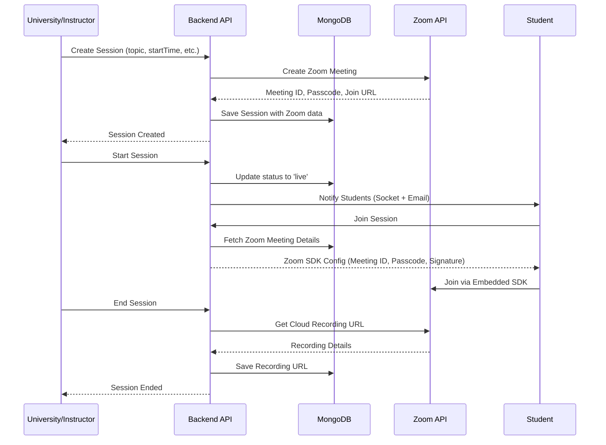

# Design Document: Zoom Live Sessions Replacement

## Overview

Replace the existing Bunny.net RTMP/HLS live streaming infrastructure with Zoom's embedded meeting SDK. The current system uses Bunny.net for video streaming with RTMP ingestion and HLS playback, requiring stream keys and signed URLs. The new system will leverage Zoom's native meeting capabilities with embedded SDK integration, simplifying the architecture while providing a more familiar meeting experience for instructors and students.

## Main Algorithm/Workflow



## Core Interfaces/Types

```typescript
interface ZoomMeetingData {
  meetingId: string
  meetingNumber: number
  passcode: string
  joinUrl: string
  startUrl: string
  hostEmail: string
  createdAt: Date
}

interface ZoomRecording {
  recordingId: string
  downloadUrl: string
  playUrl: string
  recordingType: 'cloud' | 'local'
  durationMs: number
  fileSizeBytes: number
  status: 'processing' | 'completed' | 'failed'
  createdAt: Date
}

interface LiveSession {
  _id: ObjectId
  topic: string
  description: string
  category: string
  university: ObjectId
  instructor: ObjectId
  course?: ObjectId
  enrolledStudents: ObjectId[]
  startTime: Date
  endTime?: Date
  duration: number
  status: 'scheduled' | 'live' | 'ended' | 'cancelled'
  
  // Zoom integration (replaces bunny field)
  zoom: ZoomMeetingData
  
  // Recording (updated structure)
  recording?: ZoomRecording
  
  // Metrics
  metrics: {
    peakViewers: number
    totalJoins: number
    avgWatchSecs: number
  }
}

interface ZoomSDKConfig {
  sdkKey: string
  meetingNumber: string
  passWord: string
  signature: string
  userName: string
  userEmail: string
  role: 0 | 1  // 0 = participant, 1 = host
  leaveUrl: string
}
```

## Key Functions with Formal Specifications

### Function 1: createZoomMeeting()

```typescript
function createZoomMeeting(
  topic: string,
  startTime: Date,
  duration: number,
  hostEmail: string
): Promise<ZoomMeetingData>
```

**Preconditions:**
- `topic` is non-empty string
- `startTime` is valid future date
- `duration` is positive integer (minutes)
- `hostEmail` is valid email format
- Zoom API credentials are configured

**Postconditions:**
- Returns valid ZoomMeetingData object
- Meeting is created in Zoom account
- `meetingId` and `passcode` are non-empty
- `joinUrl` and `startUrl` are valid URLs

**Loop Invariants:** N/A

### Function 2: generateZoomSignature()

```typescript
function generateZoomSignature(
  meetingNumber: string,
  role: 0 | 1
): string
```

**Preconditions:**
- `meetingNumber` is valid Zoom meeting number
- `role` is either 0 (participant) or 1 (host)
- Zoom SDK credentials (sdkKey, sdkSecret) are configured

**Postconditions:**
- Returns JWT signature string
- Signature is valid for 2 hours
- Signature includes meeting number and role

**Loop Invariants:** N/A

### Function 3: getZoomRecordings()

```typescript
function getZoomRecordings(
  meetingId: string
): Promise<ZoomRecording[]>
```

**Preconditions:**
- `meetingId` is valid Zoom meeting ID
- Meeting has ended
- Zoom API credentials are configured

**Postconditions:**
- Returns array of ZoomRecording objects
- Each recording has valid download and play URLs
- Returns empty array if no recordings available

**Loop Invariants:**
- For each recording in result: recording.status is valid enum value

## Algorithmic Pseudocode

### Main Session Creation Algorithm

```pascal
ALGORITHM createSessionWithZoom(sessionData)
INPUT: sessionData of type SessionCreateRequest
OUTPUT: session of type LiveSession

BEGIN
  ASSERT sessionData.topic IS NOT EMPTY
  ASSERT sessionData.startTime > NOW()
  ASSERT sessionData.duration > 0
  
  // Step 1: Create Zoom meeting
  zoomMeeting ← createZoomMeeting(
    sessionData.topic,
    sessionData.startTime,
    sessionData.duration,
    sessionData.instructorEmail
  )
  
  ASSERT zoomMeeting.meetingId IS NOT EMPTY
  ASSERT zoomMeeting.passcode IS NOT EMPTY
  
  // Step 2: Create database session
  session ← NEW LiveSession {
    topic: sessionData.topic,
    description: sessionData.description,
    category: sessionData.category,
    university: sessionData.universityId,
    instructor: sessionData.instructorId,
    course: sessionData.courseId,
    startTime: sessionData.startTime,
    duration: sessionData.duration,
    status: 'scheduled',
    zoom: zoomMeeting,
    enrolledStudents: []
  }
  
  // Step 3: Save to database
  savedSession ← database.save(session)
  
  ASSERT savedSession._id IS NOT NULL
  
  // Step 4: Auto-enroll students (background)
  IF sessionData.courseId IS NOT NULL THEN
    students ← getEnrolledStudents(sessionData.courseId)
  ELSE
    students ← getUniversityStudents(sessionData.universityId)
  END IF
  
  FOR EACH student IN students DO
    savedSession.enrolledStudents.add(student._id)
  END FOR
  
  database.update(savedSession)
  
  RETURN savedSession
END
```

**Preconditions:**
- sessionData contains all required fields
- Zoom API is accessible
- Database connection is active

**Postconditions:**
- Session is created in database with Zoom meeting data
- Students are enrolled in session
- Zoom meeting is scheduled

**Loop Invariants:**
- All enrolled students are valid user IDs

### Zoom SDK Configuration Algorithm

```pascal
ALGORITHM getZoomSDKConfig(sessionId, userId, isHost)
INPUT: sessionId of type String, userId of type String, isHost of type Boolean
OUTPUT: config of type ZoomSDKConfig

BEGIN
  // Step 1: Fetch session
  session ← database.findSession(sessionId)
  
  ASSERT session IS NOT NULL
  ASSERT session.zoom.meetingId IS NOT EMPTY
  
  // Step 2: Verify access
  IF isHost THEN
    ASSERT userId = session.instructor OR userId = session.university
  ELSE
    ASSERT userId IN session.enrolledStudents
  END IF
  
  // Step 3: Get user details
  user ← database.findUser(userId)
  
  // Step 4: Generate signature
  role ← isHost ? 1 : 0
  signature ← generateZoomSignature(session.zoom.meetingNumber, role)
  
  // Step 5: Build config
  config ← NEW ZoomSDKConfig {
    sdkKey: ZOOM_SDK_KEY,
    meetingNumber: session.zoom.meetingNumber,
    passWord: session.zoom.passcode,
    signature: signature,
    userName: user.name,
    userEmail: user.email,
    role: role,
    leaveUrl: CLIENT_URL + '/sessions'
  }
  
  RETURN config
END
```

**Preconditions:**
- sessionId is valid session ID
- userId is valid user ID
- User has permission to access session

**Postconditions:**
- Returns valid ZoomSDKConfig
- Signature is valid for 2 hours
- Role matches user's permission level

**Loop Invariants:** N/A

### Recording Sync Algorithm

```pascal
ALGORITHM syncZoomRecordings(sessionId)
INPUT: sessionId of type String
OUTPUT: recordings of type ZoomRecording[]

BEGIN
  // Step 1: Fetch session
  session ← database.findSession(sessionId)
  
  ASSERT session IS NOT NULL
  ASSERT session.status = 'ended'
  ASSERT session.zoom.meetingId IS NOT EMPTY
  
  // Step 2: Fetch recordings from Zoom
  zoomRecordings ← zoomAPI.getRecordings(session.zoom.meetingId)
  
  // Step 3: Process each recording
  recordings ← []
  
  FOR EACH rec IN zoomRecordings DO
    recording ← NEW ZoomRecording {
      recordingId: rec.id,
      downloadUrl: rec.download_url,
      playUrl: rec.play_url,
      recordingType: rec.recording_type,
      durationMs: rec.duration,
      fileSizeBytes: rec.file_size,
      status: rec.status = 'completed' ? 'completed' : 'processing',
      createdAt: rec.recording_start
    }
    
    recordings.add(recording)
  END FOR
  
  // Step 4: Update session
  session.recording ← recordings[0]  // Primary recording
  database.update(session)
  
  RETURN recordings
END
```

**Preconditions:**
- sessionId is valid
- Session has ended
- Zoom API credentials are valid

**Postconditions:**
- Session recording field is updated
- All recordings have valid URLs
- Recording status reflects Zoom's processing state

**Loop Invariants:**
- All processed recordings have valid recordingId

## Example Usage

```typescript
// Example 1: Create session with Zoom meeting
const sessionData = {
  topic: "Advanced React Patterns",
  description: "Learn hooks, context, and performance optimization",
  category: "Engineering",
  universityId: "uni_123",
  instructorId: "inst_456",
  instructorEmail: "instructor@university.edu",
  courseId: "course_789",
  startTime: new Date("2024-02-15T10:00:00Z"),
  duration: 90
}

const session = await createSessionWithZoom(sessionData)
console.log(`Zoom meeting created: ${session.zoom.joinUrl}`)

// Example 2: Get SDK config for student
const studentConfig = await getZoomSDKConfig(
  session._id,
  "student_123",
  false  // isHost = false
)

// Initialize Zoom SDK in frontend
ZoomMtg.init({
  leaveUrl: studentConfig.leaveUrl,
  success: () => {
    ZoomMtg.join({
      sdkKey: studentConfig.sdkKey,
      signature: studentConfig.signature,
      meetingNumber: studentConfig.meetingNumber,
      passWord: studentConfig.passWord,
      userName: studentConfig.userName,
      userEmail: studentConfig.userEmail,
      success: () => console.log("Joined meeting"),
      error: (err) => console.error("Join error:", err)
    })
  }
})

// Example 3: Sync recordings after session ends
await endSession(session._id)
const recordings = await syncZoomRecordings(session._id)
console.log(`Found ${recordings.length} recordings`)
```

## Correctness Properties

*A property is a characteristic or behavior that should hold true across all valid executions of a system—essentially, a formal statement about what the system should do. Properties serve as the bridge between human-readable specifications and machine-verifiable correctness guarantees.*

### Property 1: Session Creation with Complete Zoom Data

For any valid session creation request (non-empty topic, future start time, positive duration), creating the session should result in a session record with all required Zoom meeting fields populated (meetingId, passcode, joinUrl, startUrl).

**Validates: Requirements 1.1, 1.2, 1.5, 9.1, 9.2**

### Property 2: Input Validation Rejects Invalid Sessions

For any session creation request with invalid data (empty topic, past start time, or non-positive duration), the system should reject the request and not create a Zoom meeting or database record.

**Validates: Requirements 1.5**

### Property 3: Retry Logic on API Failures

For any Zoom API error during meeting creation, the system should retry up to 3 times with exponential backoff, and if all retries fail, return 503 without creating a database record.

**Validates: Requirements 1.3, 1.4, 8.1**

### Property 4: Course-Based Enrollment Completeness

For any session created with a course ID, all students enrolled in that course should be added to the session's enrolledStudents array.

**Validates: Requirements 2.1, 2.3**

### Property 5: University-Wide Enrollment Completeness

For any session created without a course ID, all students from the university should be added to the session's enrolledStudents array.

**Validates: Requirements 2.2, 2.3**

### Property 6: Enrollment Referential Integrity

For any session, all student IDs in the enrolledStudents array should reference valid users with student role.

**Validates: Requirements 2.4**

### Property 7: SDK Config Access Control

For any SDK configuration request, the system should only provide configuration if the user is the instructor, university owner, or an enrolled student; otherwise return 403 Forbidden.

**Validates: Requirements 3.1, 3.2, 7.2**

### Property 8: Host Role Assignment

For any SDK configuration request from an instructor or university owner, the role field should be set to 1 (host).

**Validates: Requirements 3.3**

### Property 9: Participant Role Assignment

For any SDK configuration request from an enrolled student, the role field should be set to 0 (participant).

**Validates: Requirements 3.4**

### Property 10: SDK Config Completeness

For any generated SDK configuration, all required fields should be present: sdkKey, meetingNumber, passWord, signature, userName, userEmail, role, and leaveUrl.

**Validates: Requirements 3.6**

### Property 11: Signature Validity Duration

For any generated JWT signature, the expiration time should be at least 2 hours from the generation time.

**Validates: Requirements 3.5, 4.2**

### Property 12: Signature Content Completeness

For any generated JWT signature, decoding it should reveal the meeting number and role in the payload.

**Validates: Requirements 4.3**

### Property 13: Signature Caching Consistency

For any signature generation request with caching enabled, requesting the same signature within 1 hour should return the cached value from Redis with key format `zoom:sig:{sessionId}:{userId}:{role}`.

**Validates: Requirements 4.5, 10.2**

### Property 14: Valid Status Transitions

For any session status update, the system should only allow transitions from 'scheduled' to 'live', from 'live' to 'ended', and from 'live' to 'cancelled'; all other transitions should be rejected.

**Validates: Requirements 5.5**

### Property 15: Session Start Updates Status

For any session start operation by an authorized user, the session status should change to 'live' and all enrolled students should receive notifications.

**Validates: Requirements 5.1, 5.2**

### Property 16: Session End Updates Status and Time

For any session end operation by an authorized user, the session status should change to 'ended' and the endTime field should be set to the current timestamp.

**Validates: Requirements 5.3, 5.4**

### Property 17: Recording Retrieval After Session End

For any session that ends, the system should attempt to fetch cloud recordings from Zoom API using the meeting ID.

**Validates: Requirements 6.1**

### Property 18: Recording Data Completeness

For any successfully retrieved recording, all required fields should be stored: recordingId, downloadUrl, playUrl, recordingType, durationMs, fileSizeBytes, and status.

**Validates: Requirements 6.2**

### Property 19: Recording Retry on Missing Data

For any session where no recordings are found, the system should set recording status to 'failed' and retry after 5 minutes, continuing for up to 24 hours before marking as permanently unavailable.

**Validates: Requirements 6.3, 6.5**

### Property 20: Recording Processing State Handling

For any recording in 'processing' status, the system should poll Zoom API every 5 minutes until the recording is completed or times out.

**Validates: Requirements 6.4**

### Property 21: Recording Availability Invariant

For any session with recording data, the session status must be 'ended'.

**Validates: Requirements 6.6**

### Property 22: Session Creation Authorization

For any session creation request, the system should only allow users with instructor or university role to create sessions; all other users should receive 403 Forbidden.

**Validates: Requirements 7.1**

### Property 23: Session Management Authorization

For any session start or end operation, the system should only allow the instructor or university owner to perform the operation; all other users should receive 403 Forbidden.

**Validates: Requirements 7.3**

### Property 24: Recording Access Authorization

For any recording access request, the system should only provide recording data to users authorized to view the session.

**Validates: Requirements 7.4**

### Property 25: Authorization Failure Logging

For any failed authorization attempt, the system should return 403 Forbidden and log a security event with user ID and attempted operation.

**Validates: Requirements 7.5**

### Property 26: Recording Sync Retry Logic

For any recording sync failure, the system should retry after 5 minutes for up to 24 hours before marking as permanently unavailable.

**Validates: Requirements 8.3**

### Property 27: Rate Limit Handling

For any Zoom API rate limit error, the system should queue the request and retry after the rate limit window expires.

**Validates: Requirements 8.4, 10.1**

### Property 28: API Error Logging Completeness

For any Zoom API error, the system should log the session ID, operation type, and error details.

**Validates: Requirements 8.5**

### Property 29: Credential Error Handling

For any SDK credential error (missing or invalid), the system should return 500 Internal Server Error and log the error without exposing credential details in the response.

**Validates: Requirements 8.2**

### Property 30: Meeting Data Storage Structure

For any created session, the Zoom meeting data should be stored in the zoom field (not bunny field) of the session document.

**Validates: Requirements 9.3, 9.5**

### Property 31: Webhook Processing

For any Zoom webhook event received when webhooks are configured, the system should process the event for instant recording availability updates.

**Validates: Requirements 10.4**

### Property 32: Recording Polling Frequency

For any ended session without completed recordings, the system should poll Zoom API every 5 minutes.

**Validates: Requirements 10.3**

### Property 33: SDK Secret Never Exposed

For any API response containing SDK configuration or session data, the SDK secret should never be included in the response body.

**Validates: Requirements 11.1**

### Property 34: Passcode Required for Meetings

For any Zoom meeting created by the system, the meeting should have a non-empty passcode.

**Validates: Requirements 11.2**

### Property 35: Passcode Encryption

For any meeting passcode stored in the database, the value should be encrypted.

**Validates: Requirements 11.3**

### Property 36: No Meeting Content Storage

For any session in the database, the document should not contain meeting content or chat transcripts.

**Validates: Requirements 11.4**

### Property 37: GDPR-Compliant Recording Deletion

For any recording deletion operation, all associated metadata should be removed from the database.

**Validates: Requirements 11.5**

### Property 38: Join Counter Increment

For any student join event, the session's totalJoins counter should increment by 1.

**Validates: Requirements 12.1**

### Property 39: Peak Viewers Tracking

For any session, the peakViewers value should always be greater than or equal to the current number of active viewers at any point in time.

**Validates: Requirements 12.2**

### Property 40: Average Watch Time Calculation

For any session with viewer watch time data, the avgWatchSecs field should equal the sum of all watch times divided by the number of viewers.

**Validates: Requirements 12.3**

### Property 41: Metrics Finalization on Session End

For any session that ends, all metrics (totalJoins, peakViewers, avgWatchSecs) should be finalized and stored with the session record.

**Validates: Requirements 12.4**

### Property 42: Metrics API Access

For any authorized metrics request, the API response should include totalJoins, peakViewers, and avgWatchSecs fields.

**Validates: Requirements 12.5**

## Error Handling

### Error Scenario 1: Zoom API Failure During Creation

**Condition**: Zoom API returns error when creating meeting
**Response**: 
- Log error with session details
- Return 503 Service Unavailable
- Do not create session in database
**Recovery**: 
- Retry with exponential backoff (3 attempts)
- If all retries fail, notify admin and suggest manual Zoom meeting creation

### Error Scenario 2: Invalid Signature Generation

**Condition**: SDK credentials are missing or invalid
**Response**:
- Log error with user and session IDs
- Return 500 Internal Server Error
- Do not expose credential details to client
**Recovery**:
- Check environment variables
- Verify Zoom SDK app credentials
- Regenerate credentials if expired

### Error Scenario 3: Recording Not Found

**Condition**: Session ended but Zoom has no recordings
**Response**:
- Set recording.status to 'failed'
- Log warning with meeting ID
- Return empty recording object
**Recovery**:
- Retry sync after 5 minutes (recordings may be processing)
- After 24 hours, mark as permanently unavailable

### Error Scenario 4: Unauthorized SDK Config Request

**Condition**: User requests SDK config but is not enrolled
**Response**:
- Return 403 Forbidden
- Log security event
- Do not reveal session details
**Recovery**:
- Check if user should be enrolled
- Provide enrollment link if applicable

## Testing Strategy

### Unit Testing Approach

Test each function in isolation with mocked dependencies:

- `createZoomMeeting()`: Mock Zoom API responses (success, failure, timeout)
- `generateZoomSignature()`: Verify JWT structure, expiration, and payload
- `getZoomRecordings()`: Mock various recording states (processing, completed, failed)
- `getZoomSDKConfig()`: Test role assignment, signature generation, access control

Coverage goals: 90%+ for all Zoom integration functions

### Property-Based Testing Approach

**Property Test Library**: fast-check (JavaScript/TypeScript)

**Property 1: Signature Always Valid**
```typescript
fc.assert(
  fc.property(
    fc.string(), // meetingNumber
    fc.constantFrom(0, 1), // role
    (meetingNumber, role) => {
      const signature = generateZoomSignature(meetingNumber, role)
      const decoded = jwt.verify(signature, ZOOM_SDK_SECRET)
      return decoded.exp > Date.now() / 1000
    }
  )
)
```

**Property 2: Access Control Consistency**
```typescript
fc.assert(
  fc.property(
    fc.record({
      sessionId: fc.string(),
      userId: fc.string(),
      enrolledStudents: fc.array(fc.string()),
      instructorId: fc.string()
    }),
    (data) => {
      const isEnrolled = data.enrolledStudents.includes(data.userId)
      const isInstructor = data.userId === data.instructorId
      const canAccess = isEnrolled || isInstructor
      
      try {
        getZoomSDKConfig(data.sessionId, data.userId, false)
        return canAccess // Should only succeed if enrolled or instructor
      } catch (err) {
        return !canAccess // Should fail if not enrolled
      }
    }
  )
)
```

### Integration Testing Approach

Test complete workflows with real Zoom API (sandbox account):

1. **Session Creation Flow**: Create session → Verify Zoom meeting exists → Check database consistency
2. **Join Flow**: Student requests SDK config → Verify signature → Simulate SDK join
3. **Recording Flow**: End session → Wait for recording → Sync recordings → Verify URLs
4. **Error Recovery**: Simulate API failures → Verify retry logic → Check error states

Use Zoom's sandbox environment for testing without affecting production meetings.

## Performance Considerations

### Zoom API Rate Limits
- Meeting creation: 100 requests/day per user
- Recording retrieval: 30 requests/second
- Implement request queuing and caching to stay within limits

### Signature Generation
- Cache signatures for 1 hour (they're valid for 2 hours)
- Use Redis for distributed caching across server instances
- Key format: `zoom:sig:{sessionId}:{userId}:{role}`

### Recording Sync
- Poll Zoom API every 5 minutes for ended sessions
- Use webhook notifications for instant recording availability
- Cache recording URLs for 24 hours

### Database Queries
- Index on `zoom.meetingId` for fast lookups
- Index on `status` and `startTime` for session lists
- Use lean queries when only Zoom data is needed

## Security Considerations

### Zoom SDK Credentials
- Store SDK Key and Secret in environment variables
- Never expose SDK Secret to client
- Rotate credentials every 90 days

### Meeting Passcodes
- Always require passcode for meetings
- Use Zoom's random passcode generation
- Store passcodes encrypted in database

### Signature Security
- Signatures expire after 2 hours
- Include user ID in signature payload
- Verify signature on client before joining

### Recording Access
- Require authentication for recording URLs
- Use Zoom's password-protected recordings
- Implement download token system for temporary access

### Data Privacy
- Do not store meeting content in database
- Comply with Zoom's data retention policies
- Provide GDPR-compliant recording deletion

## Dependencies

### Backend Dependencies
- `@zoom/meetingsdk`: Zoom Meeting SDK for Node.js (v2.18+)
- `jsonwebtoken`: JWT generation for signatures (v9.0+)
- `axios`: HTTP client for Zoom API calls (v1.6+)

### Frontend Dependencies
- `@zoom/meetingsdk`: Zoom Meeting SDK for Web (v2.18+)
- React component for embedded meeting view

### External Services
- Zoom API (v2): Meeting management and recording retrieval
- Zoom SDK: Client-side meeting embedding

### Environment Variables
```bash
# Zoom API Credentials (for meeting creation)
ZOOM_API_KEY=your_api_key
ZOOM_API_SECRET=your_api_secret
ZOOM_ACCOUNT_ID=your_account_id

# Zoom SDK Credentials (for client embedding)
ZOOM_SDK_KEY=your_sdk_key
ZOOM_SDK_SECRET=your_sdk_secret

# Zoom Webhook Secret (for recording notifications)
ZOOM_WEBHOOK_SECRET=your_webhook_secret

# Client URL (for leave redirect)
CLIENT_URL=http://localhost:5173
```

### Migration Notes
- Remove Bunny.net dependencies: `bunnyUtils.js`, Bunny API calls
- Update all references from `session.bunny` to `session.zoom`
- Migrate existing sessions: Create placeholder Zoom meetings or mark as legacy
- Update UI components to use Zoom SDK instead of HLS player
